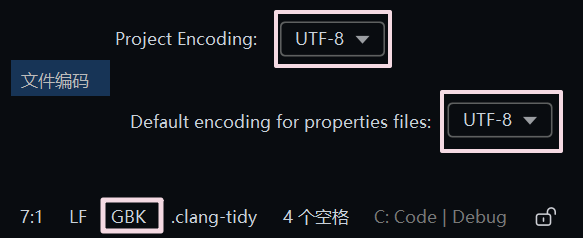
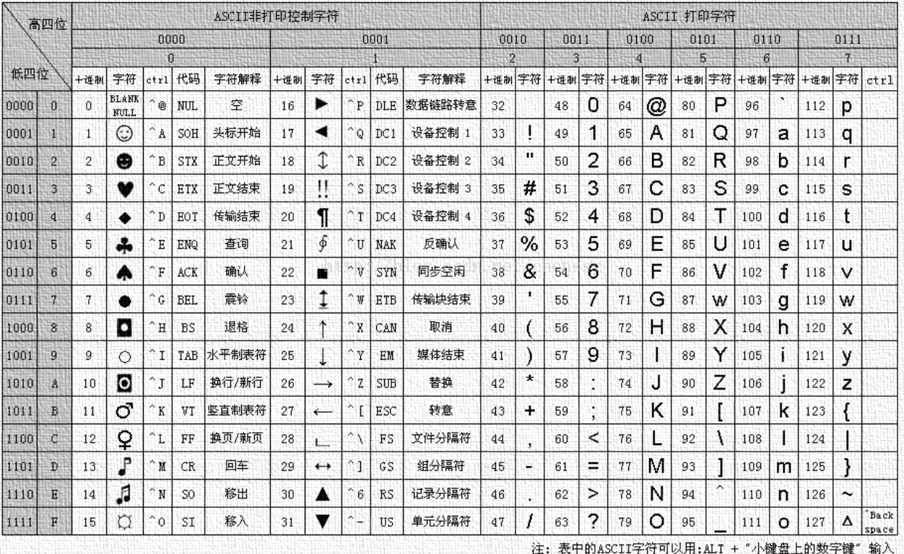
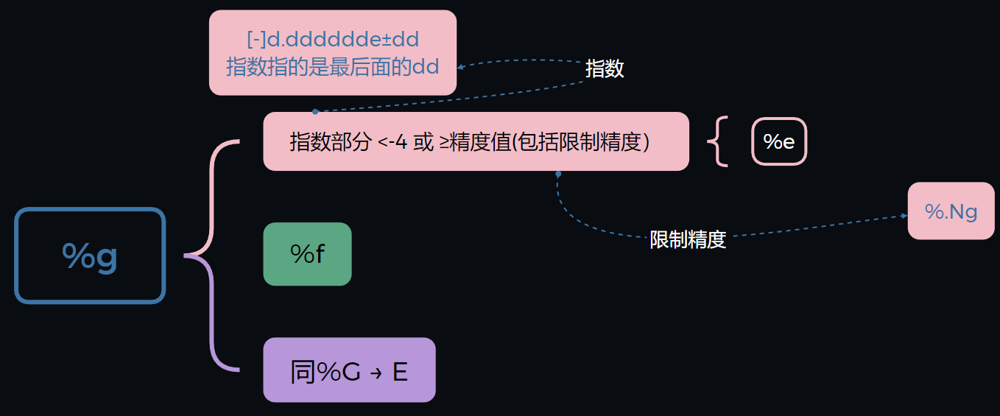
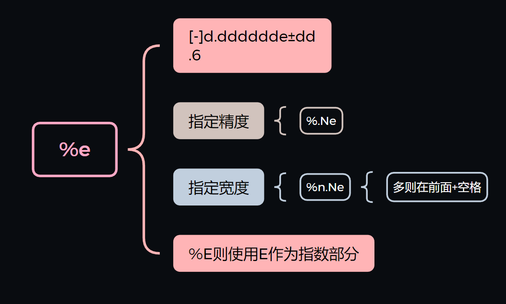
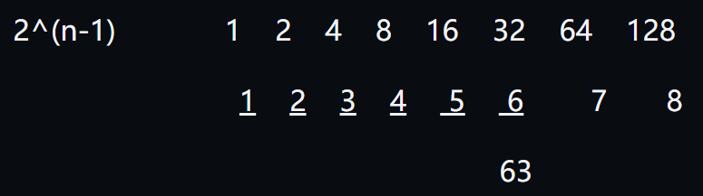
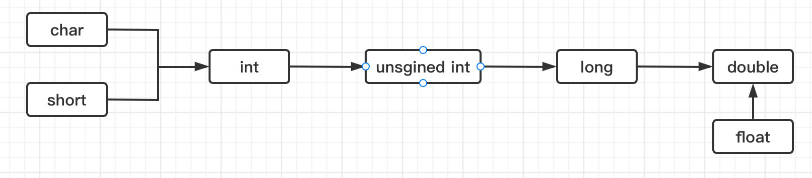
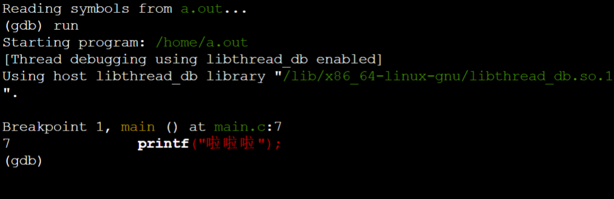

# [OnlineGDB](https://onlinegdb.com/online_c_compiler) 


# [**MinGW**](https://github.com/niXman/mingw-builds-binaries/releases)

{[x86_64-13.2.0-release-posix-seh-ucrt-rt_v11-rev1.7z](https://github.com/niXman/mingw-builds-binaries/releases/download/13.2.0-rt_v11-rev1/x86_64-13.2.0-release-posix-seh-ucrt-rt_v11-rev1.7z)}

在 Windows 上使用的 GNU 工具集合，其中包含重要的**编译器** GCC(GNU Compiler Collection)(<u>源代码→可执行指令</u>)


1. *bin*目录添加到 **环境变量** 
2. gcc --version

```bash
$ gcc main.c
```


```bash
$ ./a.out
```

> `a.out`(assembler output 汇编输出的缩写)


```bash
$ gcc -o new main.c
```


>`-o`(output)	指定编译产物**文件名** 


```bash
$ gcc -std=c99 main.c
```

> `-std`(standard版本)	按照后面的标准**编译**


```bash
$ gcc -std=c99 main.c -o new
```


***


# Neovim


**乱码问题**	


# Grammar


## 注释

### 第一种

```c
/*注释*/

/*
	这是一行注释
*/
```


可以插在行内

```c
int open(char* s /* file name */, int mode);
```

`/*file name*/`用作说明，不影响代码


### 第二种

```c
//这是一行注释

int x = 1;	//这也是
```


> 放在**双引号**中会被是为**普通字符**，注释会被**替换成一个空格**


## **二进制**	

​			2^(n-1)			 1	2	4	8	16	32	64	128

​                                       <u>1	2	3	4	 5	 6</u>	    7   	8

​															  		63

***


## 原码	反码	补码


### 	原码

- 最高位表示符号，0为正，1为负
- 4bit:   -7 ~ +7


### 	反码

- 正相同；负数：**绝对值取反** 
- 存在 -0 问题

### 	补码

- 正数相同；负数：**绝对值取反** *+1*
- **4bit**位能够表示的范围是 -8 ~ +7   (1000 ~ 0000  ~  0111)
- **C**使用的就是补码！


---


## ASCII




**25**个单词

- A	->	65

- a	->	97


***


## printf()

### 基本用法

`printf()`作用是将**参数文本**输出到屏幕上，`f`-`format`(格式化)，表示可以`定制文本`的格式

不会自动换行，添加换行符`\n`光标移动到**下一行开头**


也可在文本内换行

```c
printf("Hello\nWorld\n");
```


`printf()`是在**标准库的头文件**`stdio.h`定义的。使用这个函数之前，须在**源码的头部引入**这个**头文件**

```c
#include <stdio.h>	//只有加上这个才能使用printf()这个函数
```


***


### 占位符

> 就是这个位置能用**其他值带入**


```c
printf("There are %i apples", 3); // 3 为替换占位符的值
$ There are 3 apples
```

- 第一个字符一律为 `%` ，第二个表示占位符的**类型**
- 这里`%i`表示这里**代入的值**必须一个**整数**


可以使用**多个**占位符

```c
printf("%s said it's %i o'clock now", "Paimon", 8);
  //Paimon said it's 8 o' clock now
```

- `%s`代入得值是一个**字符串**
- 一一对应关系
- 如果 **占位符** ＜ **参数**   ->   可能会输出**内存**中的**任意值**


| % |                                                          |
| ------ | ------------------------------------------------------------ |
| a     | 十六进制浮点数，字母输出为小写                               |
| A     | 十六进制浮点数，字母输出为大写                               |
| c     | 字符                                                         |
| d     | 十进制整数（decimal）                                        |
| e     | 使用科学计数法的浮点数，指数部分的`e`为小写                  |
| E     | 使用科学计数法的浮点数，指数部分的`E`为大写                  |
| i     | 整数，基本等同于%d                                           |
| f     | 小数（包含float类型和double类型）                            |
| g     | 6个有效数字的浮点数，整数部分超过6位自动转为科学计数法，指数部分的`e`为小写 |
| G     | 等同于%g，唯一的区别是指数部分的`E`为大写                    |
| hd    | 十进制 short int 类型                                        |
| ho    | 八进制 short int 类型                                        |
| hx    | 十六进制 short int 类型                                      |
| hu    | unsigned short int 类型                                      |
| ld    | 十进制 long int 类型                                         |
| lo    | 八进制 long int 类型                                         |
| lx    | 十六进制 long int 类型                                       |
| lu    | unsigned long int 类型                                       |
| lld   | 十进制 long long int 类型                                    |
| llo   | 八进制 long long int 类型                                    |
| llx   | 十六进制 long long int 类型                                  |
| llu   | unsigned long long int 类型                                  |
| Le    | 科学计数法表示的 long double 类型浮点数                      |
| Lf    | long double 类型浮点数                                       |
| n     | 已输出的字符串数量，该占位符本身不输出，只将值存储在指定变量之中 |
| o     | 八进制整数                                                   |
| p     | 指针                                                         |
| s     | 字符串                                                       |
| u     | 无符号整数（unsigned int）                                   |
| x     | 十六进制整数                                                 |
| zd    | size_t类型                                                   |
| %     | 输出一个百分号                                               |


***


### 输出格式

> **定制**占位符的**输出格式**


#### 限制->宽度

> `printf()`允许限制占位符的**最小宽度**

```c
printf("%5d",123);	//	%d	->	十进制整数
//	输出为	"  123"
```

- `%5d`表示这个**占位符**的**宽度至少为**5位
- **不满**的话，对应的值前面添加**<space>**(空格)


- **输出**的默认值是**右对齐**，可以在占位符`%`后面插入一个`-`号

  ```c
  printf("%-5d",123);
  //	输出值为 "123  "
  ```

  - 在`123`后面添加<space>


##### 对于小数

> **限定符**会**限制所有数字**的**最小宽度**

```c
printf("%12f", 123.45);
//输出"  123.450000"		->	头部添加 2 个空格
```

- 小数**默认**显示**小数点后**6位
- `%12f`输出的浮点数**最少占据**12位（包括小数点`.`)
- 当`%Nf`中的`N`小于小数的位数时，不影响在精确到**小数点后6位**


***


#### 显示±号

> 默认只显示**负数的**`-`，显示`+`可在占位符`%`后添加一个`+`	

```c
printf("%+d",1);	//输出 +1
printf("%+d",-1);	//输出 -1
```

- `%+d`	->	带有**正负**的十进制整数	


***


#### 限制->小数位数

> `%.Nf`

```c
printf("%.2f",0.1);
//输出 0.01
```


##### 跟**限制宽度**的结合使用

```c
printf("%6.2f", 0.5);
//	输出"  0.50
```

- 头部有**两个空格**


> **最小宽度**和**小数位数**，可以通过`*`代替，再通过**参数传入**->`%*.*f`

```c
printf("%*.*f", 6, 2, 0.5);

//等同于
printf("%6.2f", 0.5);
```


***


#### 输出部分字符串

> `%s`占位符 -> 用来**输出字符串**，默认**全部输出**
>
> `.[m]s` -> `[m]`代表一个**numbers**，表示所要**输出的宽度**
>
> 
>
> ```c
> printf("%.6s","yuan shen")；
> //输出 yuan s
> ```
>
> - `%.6s`表示只输出字符串的**前6个字符**（包括<space>)


***


## 标准库，头文件

> 有些功能C语言**已经自带了**，**无需再次编写**，调用就能实现**开箱即用** 
>
> e.g.	`printf()`这个**函数**就是C语言**自带的**，只要调用它，就能实现**在屏幕上输出内容**


### 标准库

> **自带**的这些**功能**，统称为”**标准库**“（standard library)，因为它们是**写入标准的**，包括哪些**功能**，如何**使用**，都有规定，以此保证代码的**规范**和**可移植性**


### 头文件

> 不同的**功能定义**在不同的文件中，统称 ”**头文件**“（header file)。当**自带某个功能**时，一定**还会**有自带**描述这个功能**的头文件
>
> 
>
> - `printf()`的**头文件**就是**系统自带的**`stdio.h`	->	后缀`.h`


使用某个功能时，必须**先加载对应的头文件**	->	`#include`


***


## 数据类型


- **bit** 	**0**或**1**组成
- 1**B**(字节)  =  8bit
- 1个字  =  2 **B**  =  16 **bit**

### 整数

- **int**        -    4B   -    32bit		(±21亿多)
  
  > 整数默认是 int
  
- long     -    8B   -    64bit
  
  ```c
  long ld = 2l;
  //直接写2默认是一个int类型的值，后面加一个l或L表示是long类型值
  ```
  
- short    -    2B   -    16bit


### 浮点数

- float	    -	4B	-	32bit		<u>单 精度浮点数</u>

  ```c
  float f = 0.5f;
  //直接写0.5默认是一个double类型的值，后面加一个f或F表示是flaot类型值
  ```
  
    

- double    -    8B    -    64bit        <u>双~</u>
   > 常量本身默认是double类型的
  
    

### 字符

char	-	1B	-   8bit  

> (-128 ~ 127) (10000000 ~ 01111111)	0~17跟ASCII码字符对应

```c
char c = 'A'; //用单引号  
printf("%c",c);//%c --- %d则会输出存储的65
//的A代表的是A这个字符，对应的ASCII码是65，实际上c存储的是65这个数字
```


 用过ASCII打印字符

```c
char c = 65;
printf("%c",c);\\打印A
```


### 布尔类型

> `_Bool`

- 0	->	假（false）
- 1    ->    真（true）
  - `include <stdbool.h>`更方便使用


***


## 转义字符

> 允许在字符串或文本中插入**特殊字符**&**控制字符**，这些字符通常是**不能直接表示**的

| \a   | 响铃 : 7              |
| ---- | --------------------- |
| \b   | 退格 （backspace) : 8 |
| \f   | 换页 : 12             |
| \n   | 换行 : 10             |
| \r   | 回车 : 13             |
| \t   | 水平制表（table）: 9  |
| \v   | 垂直制表 : 11         |
| \0   | 空字符号 :  000       |
| \ddd | 八进制字符            |
| \xhh | 十六进制字符          |


> 八进制
>
> ```c
> char c = '\123';  // c 的值是字符 'S'
> \\'\ddd' 中的每个 d 都必须是 0-7 的八进制数字。
> ```


> 十六进制(hexadecimal)
>
> ```c
> char c = '\x1F';// c 的值是字符 ASCII 值为 31 的字符（不可见字符）
> \\'\xhh' 中的每个 h 都必须是 0-9 或 A-F/a-f 的十六进制数字。
> ```


***


## 变量

> 变量（**variale**) 可以理解为**一块内存区域**的**名字**
>
> - 通过**变量名**，可以**引用**这块**内存区域**，获取里面**存储的值**
> - 由于值可以**发生变化**，所以称为**变量**，否则就是**常量**


### 变量名

> 属于**标识符**（identifier)

#### 命名规范

-  只能由**字母**，**numbers**和**下划线**`_`组成
-  **numbers**不能在开头
-  长度 ＜ 63个字符
- **驼峰命名** 或 用***_***连接


##### 系统保留名

1. 两个`_`**开头**的 **变量名**
2. 一个`_` + **大写英语字母** 的变量名


***


### 变量的 声明

> **先声明**后使用


每个变量都有自己的**类型**（type）。**声明**变量时，必须将**变量的类型**告诉**编译器**

>```c
>int height;
>```
>
>**声明**了变量`height`，并**指定类型**为`int`
>
>* **几个**变量具有**相同的类型**，可以在**同一行**声明
>
>  ```c
>  int height, width;
>  
>  //等同于
>  int height;
>  int width;
>  ```
>
>  * **一旦声明**，变量的**类型**就**不能**在**运行时**修改


***


### 变量的 赋值

> 在变量**声明**时，就为它**分配内存空间**，但**不会清除**里面**原有的值**->变量会是一个**随机**的值	->	变量一定要**赋值**（`=`）以后才能使用
>
> ```c
> int num;
> num = 1;
> 
> //也可以是
> int x = 2;
> 
> //相同类型的可以:
> int y = 3, z = 4;
> ```
>
> - 变量的**值**应该与其**类型一致**


***


### 左值 右值

#### 左值（lvalue）

- 表示一个具体的**内存位置**

- 可被**赋值**&**取地址**

  

#### 右值（rvalue）

- 表达式结束后将**消失**的**临时值**，不能直接出现在赋值语句的左边
- 常量，表达式的计算结果，字面值
- 不能被**直接修改**&**取地址**


***


### 变量的 作用域

> 作用域（scope）-》代码**生效**的**范围**


#### **文件** 作用域

（file scope）

> 在**源码文件顶层**声明的变量，从**声明的位置**到**文件结束**都有效
>
> ```c
> int x = 1;
> int main(void)
> {
> 	printf("%i\n", x);
> }
> ```
>
> * `x`**作用域**为从**声明位置**开始的**整个当前文件**


#### **块** 作用域

（block scope）

> 由`{}`组成 -》形成的一个**单独**作用域 ->只在当前代码块中有效
>
> ```c
> int a = 1;
> 
> if (a == 1)
> {
> 	int b = 2;
>     printf("%d %d", a, b);	// 1 2
> }
> 
> printf("%d", a);	// 1
> printf("%d", b);	// 报错	->	在 {} 外，这个变量是不存在的
> ```


##### 代码块 **嵌套**

```c
{
	int i = 1;
	
	{
		int i = 2;
		printf("%d", i);	// 2 -> 	优先使用当前作用域的
	}
	
	printf("%d", i);		//1
}
```


> **函数内部**声明的**变量，外部**不可见

```c
for (int i = 0; i < 10; i++)
	printf("%d", i);	//省略了 大括号，依然是一个块的作用域

printf("%d", i);	//出错
```


***


## 格式化字符

> %

#### 单个


| c    | 单一字符   |
| ---- | ---------- |
| s    | 一个字符串 |


***


#### 十进制

 

|                | int  | long | short |
| ---- | ---- | ---- | ----- |
| 有符号    signed | d    | ld   | hd    |
| 无符号(忽略符号位)     unsigned | u    | lu   | hu    |


| float                    | double |
| ------------------------ | ------ |
| f                        | lf     |
| .Nf → (N为.后显示的位数) | .Nlf   |







***


#### 八进制

(octal)

| 无符号               | int  | long | short |
| -------------------- | ---- | ---- | ----- |
| 不带前缀             | o    | lo   | ho    |
| 带前缀(前面加一个零) | #o   | #lo  | #ho   |


***


#### 十六进制

(hexadecimal)

|            | int                            | long      | short      |
| ---------- | ------------------------------ | --------- | ---------- |
| 不带前缀   | x \ X(大小写对应A-F是否大小写) | lx \ lX   | hx \ hX    |
| 带前缀(0x) | #x \ #X                        | #lx \ #lX | #hx \  #hX |


***


## 常量

**（const）**

```c
const int value = 1;
//value值不能被修改
```


### 无符号数

(unsigned)


数据底层采用**二进制**保存，第**一**位为**符号位**，及不考虑符号位，所有的数据都是$\mathbb{N}^*$ ,如`char`类型：

- 考虑符号： -128 ~ 127

- 不考虑：    0  ~ 255    (127 + 128 = 155)


> ```c
> unsigned char c = - 65;
> printf("%u",c);			//‘%u’以无符号形式输出十进制数据
> ```
>
> 11000001（原码）	->	
>
> 10111110（反码：将正数部分全部取反）	->	
>
>  10111111（补码：反码+1 ）	->	
>
> 128 + 32 + 16 + 8 + 4 + 2 + 1 = 128 + 63  = 191（不考虑**最前面**的符号）





***


#### 以无符号形式打印

>``` c
>int i = -1;
>printf("%u",i);
>
>$ 4294967295(无符号int的最大值。)
>```
>
>int - 32bit（±21亿多）	  1$\ldots$ 01（源码） -> <u>1</u>1$\ldots$11（忽略符号的补码）


***

## 类型转换

***


#### 自动类型转换


##### **int	->	char**


```c
int a = 511;//int -  4B
char b = a;	//char - 1B 	->	只保留后面1B

$ b = -1
```


> 去除前面多余的
>
> * 511 = int -> 00000000 00000000 00000001 11111111
>
> * char -> 11111111（原码）
>   * ->  00000000 
>   * -> 00000001  
>   * -> -1（将**绝对值**复原，即1$\times$-1)


***


##### **double	->	int**


```c
double a = 3.14;
int b = a;
printf("%d",b)''
    
$ 3
```

> 直接丢失**小数部分**


***


##### **运算中的转换关系**

###### 优先级

> 先转换为 原数 中 **高优先级的**再算




> **结果**只跟 原数 中 **高优先级**的有关

```c
int a = 10, b = 3;	//原数最高优先级为 int
double d = a / b;	//int	→	double
//结果也是一个 int(小数部分省略)	->	double(在整数后面添加.0)

$ 3.000000	//去除0.333……
```


***


#### 强制类型转换

> (强转换的**类型**)	**变量** , **常量** ，**表达式**

e.g.

```c
int a = (int) 2.5;	//double (强制转化为)→	int	（赋值)→	a
```


##### 对于表达式

```c
double a = 3.14;
int b = (int) ( a + 2.8);	
//后面括号用于提升优先级，不加时只对紧跟的有效
```


##### 两个int相除后带小数

```c
int a = 10, b = 4;

double c = a / b;	//不进行类型转换，结果仍是int，导致小数丢失

double d = (double) a / b;
//对a进行强制类型转换为double，后面的b自动转换为double，结果也是double
```


***


## 运算符


### 基本 运算符


###### 除法

​		/		->  	/（注释）	->		\（转义字符)

- **两个整数**相除，得到还是一个**整数**

  - 如果要得到一个**浮点数**结果	$\Rightarrow$	至少其中**一个运算符**为浮点数

    ```c
    float x = 10.0 / 3;		// 	10.0默认是double
    printf("%f", x);
    
    //	3.333333
    ```

    


###### 取模

> `%`求**余数**	->	只能用于**整数**

```c
int a = 1, b = 2;
printf(" %d", a % b);   //	1
```

- **负数**求模	->	结果的**±**由**第一个**运算符的**±**决定

  ```c
   3 % 2	// 1
  -3 % 2	// -1
  -3 % -2	// -1
  ```

  


###### 连续赋值

```c
int a, b;
a = b = 1;   // 从右往左依次给b和a赋值1
```


> 在C语言中没有**指数**相关的运算符	->	循环实现


***


### 优先级


- `()`  >  `+ - (做符号表示，比如-1)`  >  `* / %`  >  `+ - (加减)`  >  `=`


###### 多重	运算符

```c
printf("%d",(1 - (1 + 1)) * 2);	// 最内层开始
//	-2
```


###### 逗号 运算符

- 从前往后 →
- **赋值**结果是**最后边的**

```c
int b, c;
int a = (b = 1, c = b + 2); 	//	3
```


***


### 自增自减

> 优先级**仅次于**`()`

```c
int a = 10;
printf("%d", a-- + --a);	// 10 + 8 = 18
```

- `±±a`	->	**± **                          后   返回操作**后**的值
- `a±±`    ->    先返回操作**前**的值   后  ±


为了**消除意外**推荐下面的写法

```c
/* 写法一*/
j = (i + 1);
i++;

/* 写法二 */
i++；
j = (i + 1);
```

- **自增运算**&**返回值** 分离	->	提高代码**可读性**


###### 复合赋值运算符

```c
-=	+=	*=	/= 	%=
```


***


### 位 运算符

> 操作数据底层的**二进制**


###### <<

> **左**移	->	$\times 2^n$


```c
int a = 1;
a <<= 1;	//	就是 a = a << 1
printf("%d", a);

//	2
```

- `<<`让所有的**bit**进行**左**位移

- int - 32bit

  - 1 =  00000001  向**左**移动一位（省略前面的24个0）

       = 00000010	

       = 2

    - 就像在**十进制**中，1 × 10 = 10	$\Longrightarrow$	就是往**左**移动**一**位

      $\Rightarrow$	**二进制**左移一位 -> `×2`


```c
int a = 1;
a = a << 3;		// a × 2 × 2 × 2  ->	a × 2^3
printf("%d", a);

// 8
```


`<<=`	$\Longrightarrow$ 	**运算符**`<<`	&	**赋值**运算符`=`	结合


###### \>\> 

> **右**移	->	$\div 2^n$


**尾**部**无法容纳**的值将**丢弃**，**头**部**空出来**的位置使用`0`**填充**

```c
10001010 >> 2

// 返回 00100010
```

- 最好只用于**无符号整数**`%u`，不要用于**负数**


`>>=`	$\Longrightarrow$ 	**运算符**`>>`	&	**赋值**运算符`=`	结合


###### &

> **&**（ampersand) $=$ **and**	->	按位 **与**

```c
int c = 3 & 1;
printf("%d", c);

// 1
```

-  1   $=$  00000001

   3   $=$  00000011

  `&`  $=$  00000001	=	1

  - 比较**每一个bit**，都是 **1** 	$\Longrightarrow$ 	结果对应bit为**1**
    - 其他情况一律为**0**


`&=`	$\Longrightarrow$ 	**运算符**`&`	&	**赋值**运算符`=`	结合

```c
int val = 1;
val = val & 3;

/* 简写 */
val &= 3;
```


###### |

> 按位 或

```c
int a = 1 | 2;
printf("%d", a);

// 3
```

-  1  $=$ 00000001

   2  $=$ 00000011

  `|` $=$ 00000011	=	3

  - **只有**中间**一个**bit是**1**	$\Longrightarrow$	结果对应bit为**1**
    - 其他情况一律为**0**


`|=`	$\Longrightarrow$ 	**运算符**`|`	&	**赋值**运算符`=`	结合


###### ^

> 按位 **异或**

```c
int a = 1 ^ 3;		// 00000001	00000011	->	00000010
printf("%d", a);

// 2
```

- bit**不同**	->	1


`^=`	$\Longrightarrow$ 	**运算符**`^`	&	**赋值**运算符`=`	结合


###### ~

> 按位 **非**（按位**否定**）

```c
char c = 0;			// 00000000
printf("%d", ~c);	 // 00000000	->	11111111(原码)

// -1
```

- **每一个bit**取反
- **不会**改变**变量的值**，只是**return**一个**新值**

​	


***


### 逻辑运算符

> **成立** -> 1


###### _Bool

```c
int a = 1;
_Bool c = a > 0;	// trun 
printf("%d", c);	//	1
```

- 非零的所有值    ->    真（true）
- 0	->	假（false）


###### &&	-	逻辑 与

> **两边**都为**true**	$\Longrightarrow$	**true**

```c
char c = 'D';
printf("%d", c >= 'A' && c <= 'Z');		// 65 ~ 90

// 1
```

- ​	**左**侧	->	**右**侧
  - 当第一个为**false**时  ->	直接**return** **0**	->	不会执行**右**边的


错误方式

```c
while ((x++ < 1) && (x + y < 2));	
```

- 执行完**左**侧后，`x`的值已经**变了**	->	不是**原始意图**


###### || - 逻辑 或

> 只要**一个**为真	$\Longrightarrow$	**true**


###### ==

> 判读两个值是否**相等**

```c
printf("%d", 1 == 2);	// ≠

//	0
```


###### ！=

> 判断两个值是否**不相等**

```c
printf("%d", 1 != 2);	// ≠

// 1
```


###### !

> **取反**

```c
printf("%d", !(1 == 0));	// !0	->	1
```

- $!$**优先级**很高，一定要**括()**起来


**非**0   $\Rightarrow$   0，0    $\Rightarrow$  1

```c
printf("%d", !2);	// 0
printf("%d", !0);	// 1
```


***


### 逗号 运算符


将**多个表达式**写在一起

```c
x = 1, y = 2;
```

- →运行每个**表达式**


return**最后一个**表达式的值

```c
int x;
x = (1, 2, 3);

// x = 3
```


### 三目运算符

> **expression** ? 值**1** : 值**2**	->	✔值**1**	**×**值2

```c
int i = 1;
char c = i > 2 ? 'A' : 'B';		// false -> 值2
printf("%c", c);

// B
```


***


### 优先级总结

|                                 |                                      | →    |
| ------------------------------- | ------------------------------------ | ---- |
| ()                              | 同数学中的括号，直接提升到最高优先级 |      |
| ! ~ ++ -- + -                   | 否定，按位否定，增量，减量，正负号   | ←    |
| * / %                           | 乘，除，取模                         |      |
| + -                             | 加，减                               |      |
| << >>                           | 左移，右移                           |      |
| < <= >= >                       | 小于，小于等于，大于等于，大于       |      |
| == !=                           | 等于，不等于                         |      |
| &                               | 按位与                               |      |
| ^                               | 按位异或                             |      |
| \|                              | 按位或                               |      |
| &&                              | 逻辑与                               |      |
| \|\|                            | 逻辑或                               |      |
| ? :                             | 条件                                 | ←    |
| = += -= *= /= &= ^= \|= <<= >>= | 各种赋值                             | ←    |
| ,                               | 逗号（顺序）                         |      |

- 完全记住所有运算符的优先级**没有必要**，**解决方法**是多用**圆括号**`()`，防止出现**意料之外**的情况，也有利于提高代码的**可读性**


***


## GDB调试

> GNU Debugger ()	->	调试C ，C++等程序的开源工具


### Code

```c
#include <stdio.h>

int main()
{
	for (int i =  0; i < 3; i++)
	{
		printf("啦啦啦");
	}
}
```


### Debug



> Reading symbols from a.out..
>
> 正在读取来自 a.out 的**符号信息**

- `symbols`（符号）通常指的是程序中的**函数**、**变量名称**以及其他**标识符**的信息
  - 有助于**理解**和定位程序中各个**函数**和**变量**的**位置**、名称和**结构**


> (gdb) run

- 正在执行程序


> Starting program:/home/a.out

- 正在执行的**程序**


> [Thread debugging using libthread_db enabled]
>
> 已启动使用 libthread_db 的线程调试

- `libthread_db` 是一个**库**，专门用于**调试多线程**程序
  - library for thread（线程） debugging


> Using host libthread_db library"/lib/x86_64-linux-gnu/libthread_db.so.1".
>
> 使用线程库的位置


> Breakpoint 1, main () at main.c:7

- 第**一**个**断点**
- 在**main**这个函数中**暂停**
- 断点在**mian.c**文件的7**行**


> gdb 
>
> 退出	->	简写**q**


一些别的

> [Inferior 1 (process 618) exited normally
>
> [次要进程1（进程618）正常退出]

## 流程控制


### if

```c
if(Judgment criteria)
{
	Execute code
}
```


#### 只有**一条**执行语句时

```c
if(Judgment criteria)
	Execute code;
```


#### if - else

```c
if (Judgment criteria)
{
   Execture code;
}
else
{
    Execture code;
}

```


#### else if

```c
if (Judgment criteria)
{
	Execture code;
}
else if (Judgment criteria && Judgment criteria )	//可以用&&等
{
	Execture code;
}
else
{
	Execture code;
}
```


***


### switch

> 可以**嵌套**其他的**流程控制语句**


**精确匹配**

```c
switch(目标)
{
	case 匹配值：
	Execture code;
	break;				// 没有结束语break的话，会溜到下一个case
}
```

- ```c
  char letter = 'A';
  switch (letter)
  {
  	case 'A':
  	printf("A");
  	break;
  }
  
  // A
  ```


#### default

```c
switch (目标)
{
	case：...
	default:
			其他情况下执行的代码；
}
```


***


### for


```c
for (表达式1;表达式2;表达式3)
{
	循环体；
}
```

- 表达式**1**：开始时                 **仅执行一次**

- 表达式**2**：**每次**开始 **前**          判断**一次**   ->    判断是否可以**结束**
- 表达式**3**：每次循环 **结束后**    **执行一次**


```c
for (int i = 0; i < 2; i++)
{
		
}

// 循环2次
```

- **i**	->	用于**控制**循环**结束**
- 循环**开始**之**前**先判断   是否**小于2**

​	


#### 无限循环

```c
for (;;)
{

}


/* 方法二 */

for (i = 0;;i++)
{

}
```

