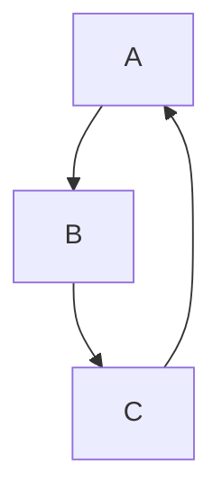
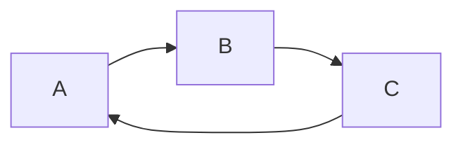
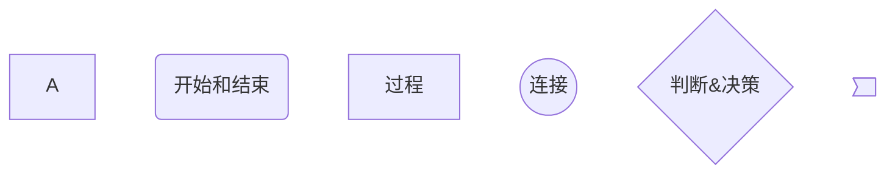
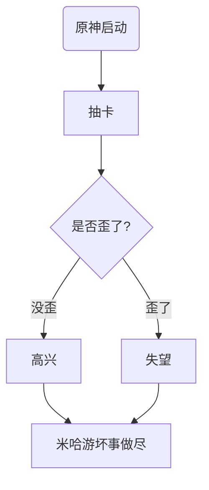
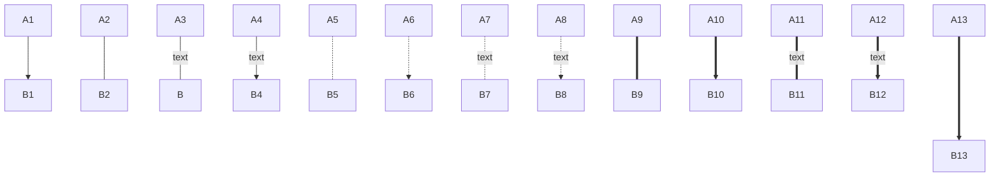
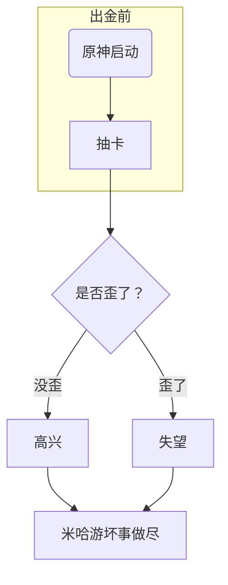
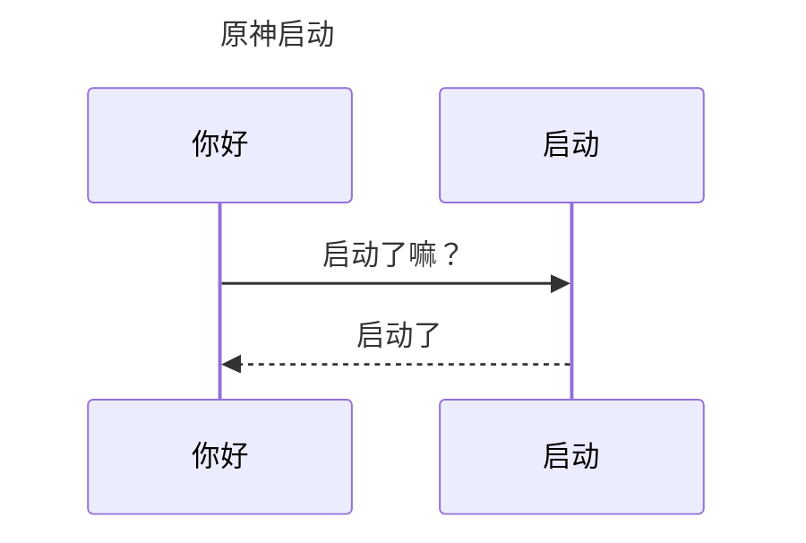

# <font color="#F0BDC6">文字</font>


斜体 * 		Ctrl + I

**粗体** \**		Ctrl + B

***粗+斜***  \***

~~删除线~~  \~~ 				Alt + Shift + 5

<u>下划线</u>  <u> </u>		Ctrl + U

==均可用_代替==  \==		Ctrl + Shift + H

`ywyj.cloud`	\` 			 Ctrl + Shift + `

<font color=orange>颜色设置</font>					<font color=orange></font>


<font color="#85D5B7">#85D5B7</font>	<font color="#D5804D">#D5804D</font>		<font color="#C5B4E5">#C5B4E5</font>	

​	<font cloor="#F0BDC6">#F0BDC6</font> 	<font color="F5DAE3">#F5DAE3</font>	<font color="FFEADC">#FFEADC</font>	 <font color="FFAAB">#FFAAB</font>	<font color="DEEFFF">DEEFF</font>

​											 	<font color="#F0BDC6"></font>		

<span style="background: linear-gradient(to right, #92C6D4, #DAEBF1); -webkit-background-clip: text; color: transparent;">过度蓝色</span>

<span style="background: linear-gradient(to right, #92C6D4, #DAEBF1); -webkit-background-clip: text; color: transparent;"></span>


<span style="background: linear-gradient(to right, #EAD6EE, #A0F1EA); -webkit-background-clip: text; color: transparent;">常用符号</span>

<span style="background: linear-gradient(to right, #EAD6EE, #A0F1EA); -webkit-background-clip: text; color: transparent;"></span>


<span style="background: linear-gradient(to right, #EEB0BB, #FBEDEF); -webkit-background-clip: text; color: transparent;">过渡色</span>

<span style="background: linear-gradient(to right, #EEB0BB, #FBEDEF); -webkit-background-clip: text; color: transparent;"></span>


<span style="background: linear-gradient(to right, #CCFBFF, #EF96C5); -webkit-background-clip: text; color: transparent;">过渡色</span>

<span style="background: linear-gradient(to right, #CCFBFF, #EF96C5); -webkit-background-clip: text; color: transparent;"></span>


**选中文本**

- **单个**	*Ctrl + D	Ctrl + Shift + ⬅/→*

- **行**	Ctrl + L

***


# <font color="#F0BDC6">Emoji</font>


**win** + **。**	

:anger:\:anger\:	

:exclamation:\:exclamation:

:question:\:question:

:+1:\:+1:

:-1:\:-1:

:heart:\:-1:


***


# <font color="#F0BDC6">表格</font>


Ctrl + **T**


****


# <font color="#F0BDC6">引用</font>


>\>		Ctrl + Shift + Q


>
>
>
>
>>\>\>


***


# <font color="#F0BDC6">列表</font>


- -	
  
  - -
    - -


* *
  
  * *
    
    Ctrl + Shift + ]


1. 
2. Ctrl + Shift + [


***


# <font color="#F0BDC6">代码</font>


````
```		Ctrl + Shift + K
````


```diff
```diff
+ 新增项
- 删除项

```


```markdown
# markdwon格式
```


`代码块`	\`代码块\`


***


# <font color="#F0BDC6">分割线</font>


\*\*\* 

\-\-\- 

\_\_\_ 


***


# <font color="#F0BDC6">跳转</font>


[Math](#Math)	\[Math](#Math)

[ywyj](https://www.ywyj.cn)	\[ywyj](https://www.ywyj.cn) 		Ctrl + K

**本层**目录文件	./


<https://ww.ywyj.cn>		 \<https://ww.ywyj.cn\>

[邮箱](<mailto:123@email.com>) 						  	\[邮箱]\(<mailto:123@email.com>)


***


# <font color="#F0BDC6">图片</font>


Ctrl + Shift + I


##  

/##<space><space>	(用来当空位)

打开文件 Ctrl + O   ------------         最近的文件 Ctrl + P

- [ ] \- [ ] 	Ctrl + Shift + X

**设置**	Ctrl  + ,

**源代码**	Ctrl + /

**打字机式**	F9

> **目录**	\[toc]	
>
> **快速生成目录**	[toc] + Enter

**提升\降低**标题级别		 Ctrl + +\-

**开头\结尾**	*Ctrl + Home \ Ctrl + End*


**快速打开** 		Ctrl + P

**大纲**				Ctrl + Shift + 1

**文件数**			Ctrl + Shift + 3

搜索				Ctrl + Shift + F


**实际大小**	Ctrl + Shift + 9

**放大**	Ctrl + Shift + =

**缩小**	Ctrl + Shift + -


**应用类窗口切换**	Ctrl + Tab

**替换**	Ctrl + H

**开发者工具**	Shift + F12


**对齐方式**	*align*


 \!\[描述]\()


⬆[^x]  \[^x]

[^x]:注释 

\[^x]:   注释


e^上标^ ^ ^

e~下标~  _ _


| 1                              | 2    |
| :----------------------------- | ---- |
| \|1\|2\|             Ctrl  + T |      |


$$
\$$$$\ \ \ \ Ctrl + Shift + M
$$

# <font color="#F0BDC6">过渡色</font> 

<a id="Math"></a>

$\frac{1}{2}$     \fracc{1}{2}

$\sqrt{1}$    \sqrt{1}

$\sqrt[2]{1}$ 	\sqrt[2]{1}

$x^2_3$		x\^2\_3

$x^{2}_{3+1}$	x\^2_{}


# <font color="#F0BDC6">LaTeX</font>


###### 希腊字母

| A  𝛼      | \mathrm {A}    \alpha                  | N  𝜈      | \mathrm {N}    \nu             |
| --------- | -------------------------------------- | --------- | ------------------------------ |
| B  𝛽      | \mathrm {B}    \beta                   | Ξ  𝜉      | \Xi    \xi                     |
| Γ  𝛾      | \Gamma    \gamma                       | O  o      | \mathrm {O}    \omicron        |
| Δ  𝛿      | \Delta    \delta                       | Π  𝜋   𝜛 | \Pi    \pi    \varpi           |
| E  𝜖   𝜀 | \mathrm {E}    \epsilon    \varepsilon | P  𝜌   𝜚 | \mathrm {P}    \rho    \varrho |
| Z  𝜁      | \mathrm {Z}    \zeta                   | Σ  𝜎   𝜍 | \Sigma    \sigma    \varsigma  |
| H  𝜂      | \mathrm {H}    \eta                    | T  𝜏      | \mathrm {T}    \tau            |
| Θ  𝜃   𝜗 | \Theta    \theta    \vartheta          | Υ  𝜐      | \Upsilon    \upsilon           |
| I  𝜄      | \mathrm {I}    \iota                   | Φ  𝜙   𝜑 | \Phi    \phi    \varphi        |
| K  𝜅   𝜘 | \mathrm {K}    \kappa    \varkappa     | X  𝜒      | \mathrm {X}    \chi            |
| Λ  𝜆      | \Lambda    \lambda                     | Ψ  𝜓      | \Psi    \psi                   |
| M  𝜇      | \mathrm {M}    \mu                     | Ω  𝜔      | \Omega    \omega               |


###### 古希腊数字

| Ϝ    | \Digamma |
| ---- | -------- |
| ϝ    | \digamma |


###### 一元操作符

| $+$      | +      |
| -------- | ------ |
| $-$      | -      |
| $\times$ | \times |
| $\cdot$  | \cdot  |
| $\div$   | \div   |
| $\neg$   | \neg   |
| $!$      | !      |
| $\#$     | \#     |


###### 关系运算符


| $<$    | <            | $>$    | >            |
| ------ | ------------ | ------ | ------------ |
| $≮$    | \nless       | $≯$    | \ngtr        |
| $≤$    | \leq         | $≥$    | \geq         |
| $⩽$    | \leqslant    | $⩾$    | \geqslant    |
| $≰$    | \nleq        | $≱$    | \ngeq        |
| $⪇$    | \nleqslant   | $⪈$    | \ngeqslant   |
| $≺$    | \prec        | $≻$    | \succ        |
| $⊀$    | \nprec       | $⊁$    | \nsucc       |
| $⪯$    | \preceq      | $⪰$    | \succeq      |
| $⋠$    | \npreceq     | $⋡$    | \nsucceq     |
| $≪$    | \ll          | $≫$    | \gg          |
| $⋘$    | \lll         | $⋙$    | \ggg         |
| $⊂$    | \subset      | $⊃$    | \supset      |
| $⊄$    | \not \subset | $⊅$    | \not \supset |
| $⊆$    | \subseteq    | $⊇$    | \supseteq    |
| $⊈$    | \nsubseteq   | $⊉$    | \nsupseteq   |
| $⊏$    | \sqsubset    | $⊐$    | \sqsupset    |
| $⊑$    | \sqsubseteq  | $⊒$    | \sqsupseteq  |


| $=$    | =      | $≐$    | \doteq  |
| ------ | ------ | ------ | ------- |
| $≡$    | \equiv | $≈$    | \approx |
| $≅$    | \cong  | $≃$    | \simeq  |
| $∼$    | \sim   | $∝$    | \propto |
| $≠$    | \neq   | $≠$    | \ne     |


| $∥$    | \parallel | $∦$    | \nparallel |
| ------ | --------- | ------ | ---------- |
| $≍$    | \asymp    | $⋈$    | \bowtie    |
| $⊢$    | \vdash    | $⊣$    | \dashv     |
| $∈$    | \in       | $∋$    | \ni        |
| $⌣$    | \smile    | $⌢$    | \frown     |
| $⊨$    | \models   | $∉$    | \notin     |
| $⊥$    | \perp     | $∣$    | \mid       |


###### 二元运算符


| $±$    | \pm      | $∩$    | \cap   | $⋄$    | \diamond         | $⊕$    | \oplus    |
| ------ | -------- | ------ | ------ | ------ | ---------------- | ------ | --------- |
| $∓$    | \mp      | $∪$    | \cup   | $△$    | \bigtriangleup   | $⊖$    | \ominus   |
| $×$    | \times   | $⊎$    | \uplus | $▽$    | \bigtriangledown | $⊗$    | \otimes   |
| $÷$    | \div     | $⊓$    | \sqcap | $◃$    | \triangleleft    | $⊘$    | \oslash   |
| $∗$    | \ast     | $⊔$    | \sqcup | $▹$    | \triangleright   | $⊙$    | \odot     |
| $⋆$    | \star    | $∨$    | \vee   | $◯$    | \bigcirc         | $∘$    | \circ     |
| $†$    | \dagger  | $∧$    | \wedge | $∙$    | \bullet          | $∖$    | \setminus |
| $‡$    | \ddagger | $⋅$    | \cdot  | $≀$    | \wr              | $⨿$    | \amalg    |


###### 否定的二元关系

| $\neq$  $\ne$      | \neq  \ne        | $\notin$            | \notin            |
| ------------------ | ---------------- | ------------------- | ----------------- |
| $\nless$           | \nless           | $\ngtr$             | \ngtr             |
| $\nleq$            | \nleq            | $\ngeq$             | \ngeq             |
| $\nleqslant$       | \nleqslant       | $\ngeqslant$        | \ngeqslant        |
| $\nleqq$           | \nleqq           | $\ngeqq$            | \ngeqq            |
| $\lneq$            | \lneq            | $\gneq$             | \gneq             |
| $\lneqq$           | \lneqq           | $\gneqq$            | \gneqq            |
| $\lvertneqq$       | \lvertneqq       | $\gvertneqq$        | \gvertneqq        |
| $\lnsim$           | \lnsim           | $\gnsim$            | \gnsim            |
| $\lnapprox$        | \lnapprox        | $\gnapprox$         | \gnapprox         |
| $\nprec$           | \nprec           | $\nsucc$            | \nsucc            |
| $\npreceq$         | \npreceq         | $\nsucceq$          | \nsucceq          |
| $\precneqq$        | \precneqq        | $\succneqq$         | \succneqq         |
| $\precnsim$        | \precnsim        | $\succnsim$         | \succnsim         |
| $\precnapprox$     | \precnapprox     | $\succnapprox$      | \succnapprox      |
| $\nsim$            | \nsim            | $\ncong$            | \ncong            |
| $\nshortmid$       | \nshortmid       | $\nshortparallel$   | \nshortparallel   |
| $\nmid$            | \nmid            | $\nparallel$        | \nparallel        |
| $\nvdash$          | \nvdash          | $\nvDash$           | \nvDash           |
| $\nVdash$          | \nVdash          | $\nVDash$           | \nVDash           |
| $\ntriangleleft$   | \ntriangleleft   | $\ntriangleright$   | \ntriangleright   |
| $\ntrianglelefteq$ | \ntrianglelefteq | $\ntrianglerighteq$ | \ntrianglerighteq |
| $\nsubseteq$       | \nsubseteq       | $\nsupseteq$        | \nsupseteq        |
| $\nsubseteqq$      | \nsubseteqq      | $\nsupseteqq$       | \nsupseteqq       |
| $\subsetneq$       | \subsetneq       | $\supsetneq$        | \supsetneq        |
| $\varsubsetneq$    | \varsubsetneq    | $\varsupsetneq$     | \varsupsetneq     |
| $\subsetneqq$      | \subsetneqq      | $\supsetneqq$       | \supsetneqq       |
| $\varsubsetneqq$   | \varsubsetneqq   | $\varsupsetneqq$    | \varsupsetneqq    |

###### 集合

| $\O$ $\emptyset$ $\varnothing$ | \O  \emptyset   \varnothing |
| ------------------------------ | --------------------------- |
| $\N$                           | \N                          |
| $\Z$                           | \Z                          |
| $\Q$                           | \Q                          |
| $\mathbb{A}$                   | \mathbb{A}                  |
| $\R$                           | \R                          |
| $\C$                           | \C                          |
| $\mathbb{H}$                   | \mathbb{H}                  |
| $\mathbb{O}$                   | \mathbb{O}                  |
| $\mathbb{S}$                   | \mathbb{S}                  |
| $∈$                            | \in                         |
| $∉$                            | \notin                      |
| $∋$                            | \ni                         |
| $⊂$                            | \subset                     |
| $⊆$                            | \subseteq                   |
| $⊃$                            | \supset                     |
| $⊇$                            | \supseteq                   |
| $∪$                            | \cup                        |
| $∩$                            | \cap                        |
| $∖$                            | \setminus                   |


###### 逻辑符号

| $∃$                               | \exists                     |
| --------------------------------- | --------------------------- |
| $∃!$                              | \exists!                    |
| $∄$                               | \nexists                    |
| $∀$                               | \forall                     |
| $¬$                               | \neg                        |
| $∨$                               | \lor                        |
| $∧$                               | \land                       |
| $\Longrightarrow$      $\implies$ | \Longrightarrow    \implies |
| $⇒$                               | \Rightarrow                 |
| $⟸$                               | \Longleftarrow              |
| $⇐$                               | \Leftarrow                  |
| $⟺$                               | \iff                        |
| $⇔$                               | \Leftrightarrow             |
| $⊤$                               | \top                        |
| $⊥$                               | \bot                        |


###### 几何

| $\overline{\rm AB}$       | \overline{\rm AB}        |
| ------------------------- | ------------------------ |
| $\overrightarrow{\rm AB}$ | $\overrightarrow{\rm AB} |
| $∠$                       | \angle                   |
| $∡$                       | \measuredangle           |
| $△$                       | \triangle                |
| $◻$                       | \square                  |
| $≅$                       | \cong                    |
| $≆$                       | \ncong                   |
| $∼$                       | \sim                     |
| $≁$                       | \nsim                    |
| $‖$                       | \|                       |
| $∦$                       | \nparallel               |
| $⊥$                       | \perp                    |
| $⊥̸$                       | \not\perp                |


###### 分隔符

| $|$    | \|        | $/$    | /          |
| ------ | --------- | ------ | ---------- |
| $‖$    | \\|       | $∖$    | \backslash |
| $( \,$ | ( \,      | $)$    | ) \,       |
| $[$    | [ \,      | $]$    | ] \,       |
| $\{$   | \\{       | $\}$   | \\}        |
| $⟨$    | \langle   | $⟩$    | \rangle    |
| $⌈$    | \lceil    | $⌉$    | \rceil     |
| $⌊$    | \lfloor   | $⌋$    | \rfloor    |
| $⌜$    | \ulcorner | $⌝$    | \urcorner  |
| $⌞$    | \llcorner | $⌟$    | \lrcorner  |


###### 箭头

| $\rightarrow$  $\to$  | \rightarrow     \to | $⇒$      | \Rightarrow     |
| --------------------- | ------------------- | -------- | --------------- |
| $⟶$                   | \longrightarrow     | $⟹$      | \Longrightarrow |
| $↦$                   | \mapsto             | $⟼$      | \longmapsto     |
| $\leftarrow$  $\gets$ | \leftarrow   \gets  | $⇐$      | \Leftarrow      |
| $⟵$                   | \longleftarrow      | $⟸$      | \Longleftarrow  |
| $↑$                   | \uparrow            | $⇑$      | \Uparrow        |
| $↓$                   | \downarrow          | $⇓$      | \Downarrow      |
| $↕$                   | \updownarrow        | $⇕$      | \Updownarrow    |
| $\leftrightarrow$     | \leftrightarrow     | $\Lrarr$ | \Lrarr          |
|                       |                     | $\iff$   | \iff            |

- **否定**形式在**单词前面**加`n`

###### 其他符号


| $∂$    | \partial | $𝚤$    | \imath |
| ------ | -------- | ------ | ------ |
| $ℜ$    | \Re      | $∇$    | \nabla |
| $ð$    | \eth     | $𝚥$    | \jmath |
| $ℑ$    | \Im      | $◻$    | \Box   |
| $ℏ$    | \hbar    | $ℓ$    | \ell   |
| $℘$    | \wp      | $∞$    | \infty |


###### 希伯来字母

| $ℵ$    | \aleph |
| ------ | ------ |
| $ℷ$    | \gimel |
| $ℶ$    | \beth |       


###### 三角函数

| $\sin$ | \sin  | $\arcsin$ | \arcsin  |
| ------ | ----- | --------- | -------- |
| $\csc$ | \csc  | $arccsc$  | \arccsc  |
| $\cos$ | \cos  | $\arccos$ | \arccos  |
| $\sec$ | \sec  | $arcsec$  | \{arcsec |
| $\tan$ | \tan  | $\arctan$ | \arctan  |
| $\cot$ | \cot  | $arccot$  | arccot   |


###### 双曲函数


| $\sinh$               | \sinh               | $\operatorname{arsinh}$ | \operatorname{arsinh} |
| --------------------- | ------------------- | ----------------------- | --------------------- |
| $\operatorname{csch}$ | \operatorname{csch} | $\operatorname{arcsch}$ | \operatorname{arcsch} |
| $\cosh$               | \cosh               | $\operatorname{arcosh}$ | \operatorname{arcosh} |
| $\operatorname{sech}$ | \operatorname{sech} | $\operatorname{arsech}$ | \operatorname{arsech} |
| $\tanh$               | \tanh               | $\operatorname{artanh}$ | \operatorname{artanh} |
| $\coth$               | \coth               | $\operatorname{arcoth}$ | \operatorname{arcoth} |

###### 积分

| $\int$   | \int   |
| -------- | ------ |
| $\iint$  | \iint  |
| $\iiint$ | \iiint |
| $\oint$  | \oint  |


###### 点号

| $\cdot$  | \cdot  |
| -------- | ------ |
| $\cdots$ | \cdots |
| $\ldots$ | \ldots |
| $\vdots$ | \vdots |
| $\ddots$ | \ddots |


***


# [绘图](https://mermaid.nodejs.cn/syntax/quadrantChart.html)


## <span style="background: linear-gradient(to right, #92C6D4, #DAEBF1); -webkit-background-clip: text; color: transparent;">流程图</span>

> \`\`\`mermaid	->	美人鱼


**graph**(图)


##### <span style="background: linear-gradient(to right, #92C6D4, #DAEBF1); -webkit-background-clip: text; color: transparent;">方向描述</span>

| TB   | ↓    |
| ---- | ---- |
| BT   | ↑    |
| RL   | ←    |
| LR   | →    |

- T = top	B = bottom	L = left	R = right	D = down




- graph TB;

  A-->B

  B-->C

  C-->A




- graph LR

  A-->B

  B-->C

  C-->A


***


##### <span style="background: linear-gradient(to right, #92C6D4, #DAEBF1); -webkit-background-clip: text; color: transparent;">常用符号</span>




- graph TB

  A				->			**默认**

  B(<font color="#FFAAB">圆角形</font>)	->		    **开始** & **结束**

  C[<font color="#FFAAB">矩形</font>]	   ->			**过程**

  D(( <font color="#FFAAB">圆</font> ))	  ->			**连接**

  E{ <font color="#FFAAB">菱形</font> }	 ->			**判断** & **决策**

  F> <font color="#FFAAB">右向旗帜</font> ]

  - 节点名

- 前面可以+**id**   -> **节点**的**唯一标识**




- graph TB
  	begin(原神启动)-->draw[抽卡]
  	draw  --> withdraw{是否歪了?}
  	withdraw --> **|**没歪**|**happy[高兴]	-->	continue
  	withdraw --> **|**歪了**|**sad[失望] --> continue[米哈游坏事做尽]


***


##### <span style="background: linear-gradient(to right, #92C6D4, #DAEBF1); -webkit-background-clip: text; color: transparent;">连线</span>




```c
graph TB
A1-->B1
A2---B2
A3--text---B
A4--text-->B4
A5-.-B5
A6-.->B6
A7-.text.-B7
A8-.text.->B8
A9===B9
A10==>B10
A11==text===B11
A12==text==>B12
A13===>B13
```


***


##### <span style="background: linear-gradient(to right, #92C6D4, #DAEBF1); -webkit-background-clip: text; color: transparent;">子图标</span>




- graph TB
  		<font color="#FFAAB">subgraph</font> 出金前
    			begin(原神启动)-->draw[抽卡]
    		<font color="#FFAAB">end</font>
    		draw --> withdraw{<font color=red>" </font>是否歪了？<font color=red>" </font>}
    		withdraw --> |没歪|happy[高兴]-->continue 
    		withdraw --> |歪了|sad[失望]-->continue[米哈游坏事做尽]


***


## <font color="#F0BDC6">序列图</font>

> sequence diagram


​	



- 竖直的线段表示**时间的流逝**``
