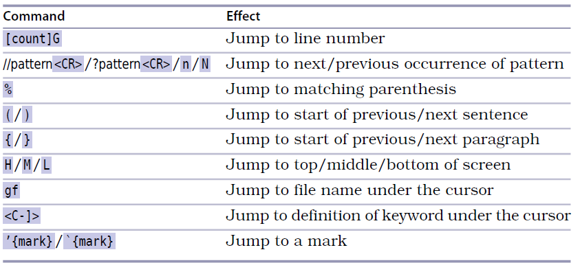

# 技巧55： 遍历跳转列表
> Vim 会记录跳转的前后位置，提供命令原路返回

#### `:jumps` 列出跳转列表的内容
#### `<C-o>`,`<C-i>` 跳到跳转列表的文件中之后和之前的文件

#### 一些跳转动作：
  

1. `[count]G`跳转到制定行号，比如`10G`跳转到第10行
2. `/pattern<CR>`跳转到下一个`pattern`字符串出现的位置
3. `?pattern<CR>`跳转到上一个`pattern`字符串出现的位置
4. `%` 跳转到匹配的括号所在的地方
5. `(` 跳转到上一句开头
6. `)` 跳转到下一句开头
7. `{` 跳转到上一段开头
8. `}` 跳转到下一段开头
9. `H` 跳到当前屏幕最上方的行(`我自己实际尝试离屏幕顶部还有几行距离`)
10. `M` 跳到屏幕中间的行(`H`和`L`的中间行)
11. `L` 跳到当前屏幕最下方的行(`我自己实际尝试离屏幕顶部还有几行距离`)
12. `gf` 跳到光标下的文件名中去（文件需要和当前的文件在同一路径下）
13. `<C-]>` 跳到光标所在关键字的定义位置
14. `` `{mark}``跳转到一个位置标记

`<C-o>` 和`<C-i>` 搭配使用，可以在当前编辑文件和之前编辑文件之间快速切换

   

|上一篇|下一篇|
|:---|---:|
|[技巧54 在匹配括号间跳转](../chapter8_doc_jump/tip54.md)|[技巧56 遍历改变列表](tip56.md)|
