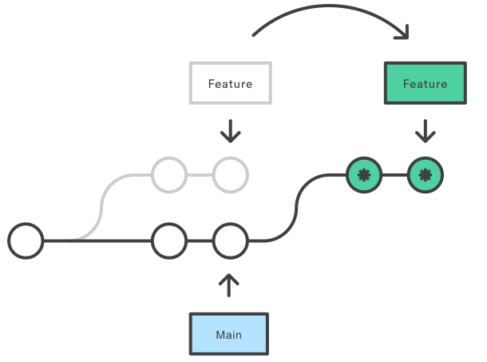

# -Install

```bash
apt install git
```

> apt	Advanced Package Tool	高级包管理工具


*****


# initialization

设置 ==用户名== 和 ==邮箱==

```bash
git config --global user.name "Your Name"
git config --global user.email email@gmail.com
git config --global credential.helper store
```

> global				在用户的 **所有Git操作** 中生效
>
> credential.helper	凭据助手
>
> store				 储存
>
> // 有**空格**需要用 `“”`


查看信息

```bash
git config --global -l
```


****


# New

> 仓库	Repository	Repo


## **本地**仓库


### 初始本地仓库

```bash
git init [目录名字]
//不加默认是当前文件
```


### `.git`

> 存放了**Git仓库**的所有数据，删除❌后不再有这个仓库


###  文件

```bash
ls -altr
```

> `-a`	**all**
>
> `-l`	**long**
>
> `-t`	**time**	    **最后**修改时间排序
>
> `-r`	**reverse**	逆序	最新的在**最后面**


****


## **远程**仓库


```bash
git clone <url>
```


******


# Area


### **工作**区

> Working Directory	
>
> 
>
> > **编辑** 和 **修改文件** 的地方


$\Downarrow$	`git add <file> / *.txt / .` 			$\Uparrow$	`git rm --cached <file>`

​			添加快照								  	     remove   已缓存


### **暂存**区

>Staging Area / Index(索引)		一般**存放**在`.git/index`中
>
>
>
>```bash
>git ls-files
>```
>
>> **临时**存储区域，用于保存**准备**提交到 Git仓库的修改内容


$\Downarrow$ 	`git commit / -am "tip"`		( -a  将==已追踪==的文件从  $\Longrightarrow$)

​						all [message](#message)		


### **本地**仓库

> Local Repository
>
> > 通过 `git init` 创建的仓库，存放项目 **版本信息** 和 **代码历史**


`git log`	/	`git log --oneline`(一行精简显示)			查看提交**日志**

> 
>
> > 头文件/当前指针	$\longrightarrow$ 	主分支
> >
> > 嘿，你现在正在 **主分支** 上工作，所有的操作都会影响这个 **主分支**(**指挥棒**)


### Replenish


#### <a id="message">-m</a>

> **开头**以一条简短的（≤50个字符）描述变化，
>
> 然后是一条==空行==，
>
> 然后是**更详细**的描述。


##### 查看内容


###### 指定

```bash
git show <ID>
```

​	

###### 所有

```bash
git log -p		#关注代码的的具体更改

p - patch(补丁)
```


```bash
git log --stat --summaty	#了解提交影响及其变化概括
		  统计     摘要
```


****


# State

```bash
git status {-s}		# s - short
```

> 
>
> 
>
> 
>
> ==??==	**U**ntracked	未追踪
>
> ==M== 	**M**odified	 已**修改**
>
> ==A==  	**A**dded	    已添加到**暂存区**
>
> ==D==	 **D**eleted	   已**删除**
>
> ==R==	 **R**enamed	 重命名
>
> ==U==	 **U**pdated	  已更新未合并


## 未跟踪

> Untrack
>
> >新创建，未被Git管理


$\Downarrow$ 	`git add .`


## 未修改

> Unmodified
>
> > 已被Git管理，但未修改


$\Downarrow$ 


## 已修改

> Modified
>
> > 已修改，但未添加到**暂存区**


$\Downarrow$ 


## 已暂存

> Staged
>
> > 修改后，添加已到**暂存区**


******


# Rollback


> git **reset**  --soft / hard / mixed	HEAD^
>
> ​	重置							上一个版本


## soft

> 退回来，文件依旧被 **追踪**()


## mixed

> 默认

退回来，**不**跟踪()


## hard

> **完全**回退，包括各状态更改都会被删除


## 回溯

> `git reflog`
>
> > reference log	参看日志	可以理解为**监控**

用`git reset --hard <ID>` 回退到这个版本

> 工作区跟仓库全部退回来


******


# Compare


## 三个区域


### 工作区 - 暂存区


> ```bash
> git diff	#差异
> ```

```bash
$ git diff
diff --git a/3.txt b/3.txt      # 比较文件 `3.txt` 的两个版本
index 55bd0ac..1e6fd03 100644   # 旧..新 文件权限(普通文件)
--- a/3.txt                     # 旧版本
+++ b/3.txt                     # 新版本
@@ -1,2 +1,3 @@                 # 旧文件(1-2行),新文件(1-3行)
-333    # 旧版本内容
+444    # 新版本内容
```


### 工作区 - 本地仓库

 ```bash
 git diff HEAD	# HEAD - 指向分支最新提交节点
 ```


### 暂存区 - 本地仓库

 ```bash
 git diff --cached	#cached - 已暂存
 ```


## **版本**


### 不同版本

```bash
git diff <ID₁> <ID₂>
```


> HEAD				 最新的提交
>
> HEAD**^** / HEAD**~**	上一个版本
>
> HEAS~<n>     	   上<n>个版本


### 只查看文件的差异

```bash
git diff <ID₁> <ID₂> <fileName>
```


## **分支**

```bash
git diff <branch_name> <branch_name>
```


****


# Delete files

### M_1

```bash
git rm <file.name>				# 工作区 ＆ 暂存区
git commit -m "delet file.name" # 提交到本地仓库

git rm --catched <file.name> 	# 版本库
```


### M_2

```bash
rm <file.name>
git add <file.name> / .			#更新到 暂存区
```


*****


# .gitignore

> .git<font color="FFAAB">ignore</font>  忽略
>
> **忽略**一些不应该被加入到 **版本库** 中的文件

 

### 忽略原则

- **系统** 或 如 **软件** **自动生成**的文件

- 编译生成的**中间文件** 或 **可执行文件**

  > e.g.  Java 编译生成的 `.class` 文件，C 编译生成的 `.o` 文件

- 运行时**自动生成**的文件

  > 日志文件`.log`、缓存文件、临时文件

- 包含**敏感信息**的配置文件

  > 用户名、密码、Token 


### add


###### file

```bash
echo <file.name> > .gitignore	# echo(回响)

echo *.log >> .gitignore		#忽略所有的 日志文件
```

> 查看**被管理**的的文件	`git ls-files`


###### folder

```bash
echo <folder.name>/ 
```


### [匹配规则](https://git-scm.com/docs/gitignore) $\downarrow$


#### 注释

> 空行 &  `#` 开头


#### Blob模式匹配

> Binary Large Object	二进制大对象
>
> 在一大块数据中找到符合特定特征的部分


##### *

> 任意个 char  
>
> 
>
>  `*.log`			e.g.    `1.log` `2.log`


##### !

> 排除
>
> `!access.log`	追踪文件，即使前面忽略了 `.log`


##### ?

> **单个**字符       `a?.txt`              e.g.    `a1.txt` `a2.txt`


##### [ ]

> 字符**集合**	`[abc]`		e.g.  `a/b/c`
>
> 
>
> 可以使用`-` 
>
> [0-9]	任意一个数字
>
> [a-z]	 任意一位小写字母


##### **

> 任意中间目录
>
> 
>
> /home/ <font color="FFAAB">**</font>/a.txt
>
> ⬇ (可以匹配)
>
> /home/ <font color="FFAAB">user/docs</font>/a.txt


##### /


###### forward

> `/Document`
>
> 
>
> 仅忽略当前目录下的==文件==


###### back

> `Folder/`
>
> 
>
> 仅忽略当前目录下的==文件夹==
>
> `document`


*****


# Local Repo $\Lrarr$ Github


### [SSH](https://docs.github.com/zh/authentication)

> Secure Shell


#### 生成密钥对

```
ssh-keygen
```

- `keygen`	-	key **generator**(生成密钥的工具)


#### 配置Github公钥

> `.pub`


#### 测试连接

```bash
ssh -T git@github.com
```

- `-T`	-	`--no-tty`	-	`--no-teletypewriter`  不需要交互式终端支持


### 初始化

```bash
git init
git add .
```


###  关联

```bash
git remote add origin <url>			#设置别名为origin
```

> remote	-	远程
>
> origin	 -	 原始
>
> 
>
> 可以添加多个仓库


###### Replenish

```bash
git remote -v		 #查看的远程仓库信息
git remote set-url origin <new_URL>		#关联系新的URL
```


### 主分支重命名

```
git branch -M main
```

> -M	-	--move


### 拉取

```bash
git pull <远程仓库名> < 远程分支名>:<本地分支名> --rebase	
		   origin             main
#可以直接用 git pull
```

- `--rebase`	-	重新基准

  > 让**本地更改**排在**远程更改**==后==


### 推送

```bash
git push <远程仓库名> <本地分支名>
			  origin     main
```

- `-u`	-	upstream branch(上游分支)


### 修改推送的注释

```bash
git commit --amend -m "……"		#amend - 修正
git push origin main -f
```

​	

​	


****


# Branch


### 查看所有

```bash
git branch
```

- \*  当前分支	 


### 提交

> <branch_name>:\<number>


### 创建

```bash
git branch <branch_name>
```

- e.g. 
  - dev - development(开发)    开发的**主分支**
  - feat - feature (特点)          开发**特定功能**


### 删除

```bash
git branch -d <branch_name>
		   -D				# 如果没有合并
```


### 切换

#### M_1


```bash
git switch <branch_name>
```


#### M_2

```bash
git checkout <branch_name>
	 切换
```

- `git checkout` 还可以**恢复**文件或目录**到之前的状态**
- 如果分支名称与文件**名称相同**，默认切换分支，**容易出现歧义**


#### M_3

```bash
git checkout -b <branch_name> <ID>
	  切换	--branch
```

> ==创建==并==切换==到 以指定提交`<ID>`为起点的`<branch_name>`==新分支==


### Merge - 合并

```bash
git merge <branch_name>
	 合并
```

- ==当前分支==就是合并的**默认分支**


### Rebase - 变基

> 可以将提交**线性化**，最终形成一条==直线==的提交历史

```bash
git rebase <branch_name>
```


```bash
* Feature
git rebase Main			#当前 -> 目标分支
```




### Fetch - 获取


###### 获取更新

```bash
git fetch <URL> "Remote branch name"
```

- 并不会自动整合到**本地仓库**


###### 比较差异

```bash
git log -p HEAD..FETCH_HEAD	  #比较本地仓库的HEAD 与 FETCH_HEAD 的内容
```

- `-p` 显示具体的**文件改动**(patch)


### 查看分支

```bash
git log --all --oneline --graph --decorate
                                   修饰
```

- 设置别名

  ```bash
  .bashrc		-	run commands
  
  alias graph="git log --all --oneline --graph --decorate"
  
  source ~/.bashrc	-	读取并执行
  ```


### 回退

```bash
git reset {--hard} <ID>
	 回退
```


****


# 解决合并冲突


### 查看冲突文件的==列表==

```bash
git status
```


### 查看冲突具体==内容==

```bash
git diff
```

- 

    ```bash
    <<<<<<< HEAD
    // 当前分支的代码
    =======
    // 合并进来的代码
    >>>>>>> branch_name
    ```


### 编辑冲突文件

- 保留需要的部分
- 删除 `<<<<<<<`、`=======` 和 `>>>>>>>` 等标记


### 提交

```bash
git commit -am “ Resolved merge conflict”	# 解决合并冲突
```


### 中断合并

```bash
git merge --abort
```


****


# Development Process


****


# Official documentation

[Tutorial](https://git-scm.com/docs/gittutorial) -> [Everyday](https://git-scm.com/docs/giteveryday) -> [Documentation](https://git-scm.com/docs/git/en) -> [CLI](https://git-scm.com/docs/gitcli)

> CLI	-	Command Line Interface	命令行界面


*****


