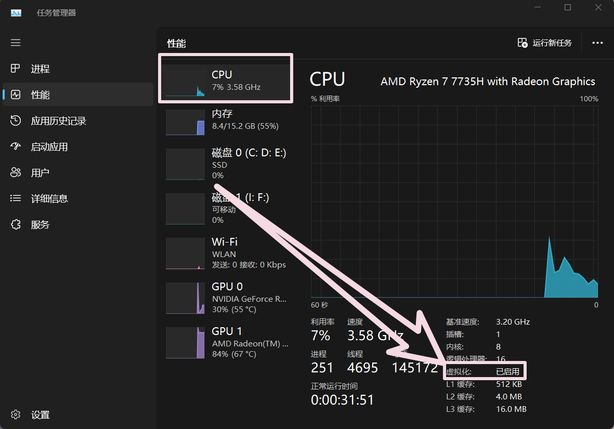
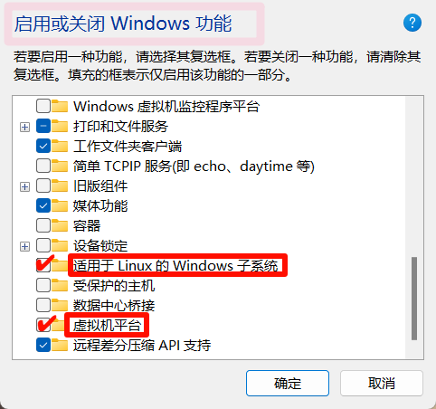
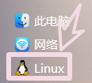
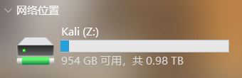
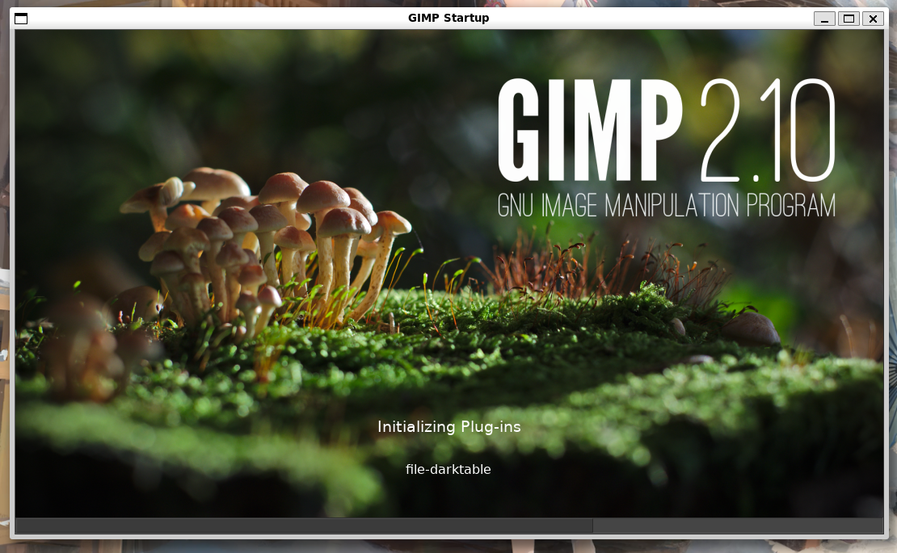
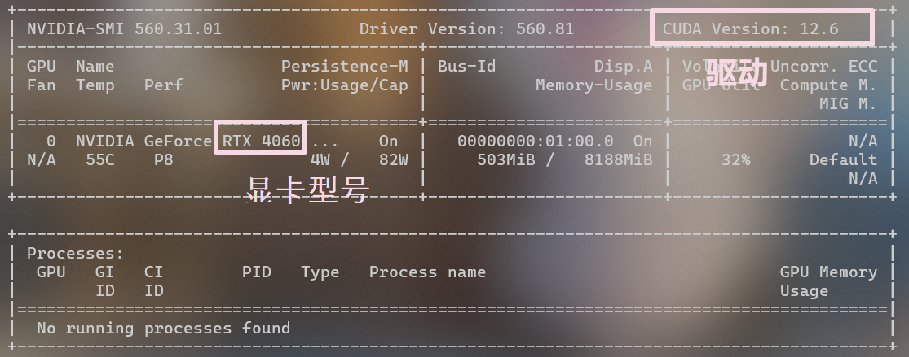
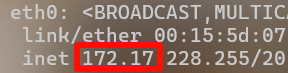
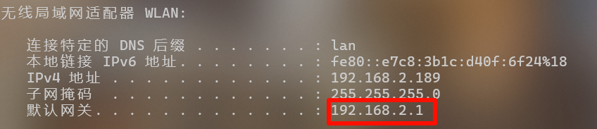
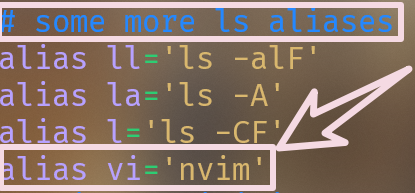

# Neovim

> 是**Vim文本编辑器**的**改进版**，增加了更强的**扩展性**&**现代化功能**

- vim
  - 高度可定制的**文本编辑器**


[练习](https://www.vimgolf.com/)


***


# 在**widows**下安装


## 安装**Linux**

> 在 Windows 下使用 ==WSL== 运行 ==Linux==
>
> > Windows Subsystem for Linux	->	适用于 Linux 的 Windows 子系统


参考

-  [超详细的WSL教程：Windows上的Linux子系统](https://www.bilibili.com/video/BV1tW42197za/?spm_id_from=333.999.0.0&vd_source=efeaf6f967e48f58317a9291cef584cd)


****


### 开启 CUP虚拟化


> 一般默认开启了




### 启用 功能




****


###  安装

> 以 管理员权限 打开 ==PowerShell==


###### 更新

```shell
wsl --update
```


###### 可安装的发行

```shell
wsl -l -o
//online
```


######  kali-linux

```shell
wsl --install kali-linux --web-download
```

> --web-download	通过服务器下载而不是本地缓存的


###### Ubuntu


```shell
wsl --install
// 默认安装命令，但不是最新的
```


###### 查看安装的列表

```shell
wsl -l -v
```


###### 更改默认的子系统

```shell
wsl --set-default 子系统名字
```


###### 查看安装版本

```shell
cat /etc/os-release
```


****


### 卸载

```shell
wsl --unregister 子系统名字
```


****


### 启动


> 或
>
> ```shell
> wsl -d 子系统名
> ```


****


### 退出

> 关闭窗口 或 exit


****


### 备份

```shell
wsl --export kail-linux D:\Data\Software\WSL\lail-linux.tar

//先用  wsl -l  查看名字
//lail-linux.tar 为导出的压缩包名,默认为桌面
```


****


### 导入


```shell
wsl --import 取个名字 保存位置 压缩包路径
```


****


### 文件共享


#### Linux -> Windows

###### 查看挂载卷

> Windows盘作为 ==目录== 挂载进 Linux系统

❗这种挂载卷的方式性能不是很好,如果涉及到大量的 ==IO操作== 建议将文件 **拷贝**到子系统


```shell
df -h
```

- >disk free  		human-readable	 
  >
  >磁盘剩余空间	 人类可读


****


#### Windows -> Linux


在**导航窗格**




拖动 ==Linux盘符== 到 ==此电脑== 就能在此电脑创建一个新的盘符




****


### kali **远程桌面连接**


###### 更新软件源

```shell
sudo apt update
```


###### 安装

```shell
sudo apt install kali-win-kex
```


###### 连接

```shell
kex --esm --ip -sound
```

> esm	 Enhanced Session Mode 增强会话
>
> ip	    指定连接的ip(默认自动)
>
> sound   启动音频支持，即可播放声音


****


### **WSL** 的 跨系统操作

> Windows Subsystem for Linux	->	适用于 Linux 的 Windows 子系统


****


### Linux  -> Windows

> 直接运行Windows程序


###### 给typora设置快捷打开

```bash
nano ~/.bashrc
alias md='/mnt/d/Data/Software/Typora/Typora.exe'
source ~/.bashrc
```


###### 记事本打开文件

```shell
notepad.exe 需要打开的文件名
```


###### 资源管理器 打开 当前目录

```
explorer.exe .
```


### Windows -> Linux


###### 结合使用命令

```shell
Get-ChildItem | wsl grep Name
```

- > 列出当前目录下的所有 文件 和 文件夹,然后通过 `WSL` 使用 `grep` 筛选出包含Name 的文件和文件夹


****


### WSLG

> G - GUI
>
> Linux里面带 `UI的应用` 直接以 `Windows窗口` 的形式打开  


##### e.g.


###### 更新==apt-get== 

```shell
sudo apt-get update
```


###### 安装


```shell
 sudo apt-get install gimp
```


###### 启动

直接输入 ==软件名==

```shell
gimp
```




****


### 显卡直通

> 方便运行一些 Linux版本 的 AI大模型


```shell
nvidia-smi
```

> nvidia-System Management Interface
>
> 英伟达 系统     管理            界面




****


### 网络


#### 原来的


###### Linux

```shell
ip a
//linux
```

 


###### windows

```shell
ipconfig
//windows
```




> 而这不在一个网段上为 ，NAT网络


****


#### 镜像网络

> 共用同一个IP


###### 创建配置文件


C:\Users\Administrator

- 创建配置文件 `.wslconfig`


```shell
[wsl2]
networkingMode=mirrored
```


###### 关闭所有wsl服务

```shell
wsl --shutdown
```


###### 启动

> 等个8秒后启动


****


## 安装**powershell**


> 预装的版本较低

.[PowerShell.mis](https://github.com/PowerShell/PowerShell/releases/tag/v7.4.4)


*****


## [美化**Powershell**](https://www.youtube.com/watch?v=-G6GbXGo4wo&t=491s&ab_channel=TroubleChute)


#### [Color](https://windowsterminalthemes.dev/)


> 将这些内容复制到 JSON文件 中

{
  "name": "Duotone Dark",
  "black": "#1f1d27",
  "red": "#d9393e",
  "green": "#2dcd73",
  "yellow": "#d9b76e",
  "blue": "#ffc284",
  "purple": "#de8d40",
  "cyan": "#2488ff",
  "white": "#b7a1ff",
  "brightBlack": "#353147",
  "brightRed": "#d9393e",
  "brightGreen": "#2dcd73",
  "brightYellow": "#d9b76e",
  "brightBlue": "#ffc284",
  "brightPurple": "#de8d40",
  "brightCyan": "#2488ff",
  "brightWhite": "#eae5ff",
  "background": "#1f1d27",
  "foreground": "#b7a1ff",
  "selectionBackground": "#353147",
  "cursorColor": "#ff9839"
},


****


#### [Fonten hancement](https://www.programmingfonts.org/#cascadia-code)


安装ttf文件


****


#### [Icon](https://ohmyposh.dev/docs/installation/windows)


###### 下载on my posh


```shell
winget install JanDeDobbeleer.OhMyPosh -s winget
```


*****


###### 重启软件


*****


###### 添加到环境变量

```shell
$env:Path += ";C:\Users\user\AppData\Local\Programs\oh-my-posh\bin"
```


****


###### 查看可用主题

```shell
Get-PoshThemes
```

> 就是将主题名字跟上面的初始化换一下


****


###### 更换主题


创建配置文件

```shell
New-Item -Path $PROFILE -Type File -Force
```


用记事本打开

```shell
notepad $PROFILE
```


添加下面行

```shell
oh-my-posh init pwsh --config "$env:POSH_THEMES_PATH\1_shell.omp.json" | Invoke-Expression
```

> 这个就是主题，需要更换的话就直接修改 `.json` 前面的名字


****


## 配置**Linux**


###### 设置显示颜色

```shell
set $TERM=xterm-256color
```


*****


###### 下载字体

> 里面包含需要用的图标

```shell
oh-my-posh font install
```


****


###### 下载解压缩软件

> unzip

```shell
sudo apt-get update
sudo apt-get install unzip
```


*****


###### 下载

```shell
curl -s https://ohmyposh.dev/install.sh | bash -s -- -d ~/bin
```

> -d 后面指定的是下载目录


****


编辑 bashrc 文件

> bash Run Commands
>
> > Bourne Again SHell


```bash
nano ~/.bashrc
```

> nano 轻量文本编辑器，直观点


在文件结尾添加

```shell
export PATH=$PATH:/root/bin
eval "$(oh-my-posh inti bash --config ~/.cache/oh-my-posh/themes/1_shell.omp.json)"
```


按 `Ctrl+S` 保存


****


## 安装**nvim**


###### 字体


[Nerd Fonts](https://www.nerdfonts.com/)


###### gcc

```bash
sudo apt update
sudo apt install gcc
```


下载开发工具


[lazygit](https://github.com/jesseduffield/lazygit?tab=readme-ov-file)


> git 命令的简单终端用户界面


- **lazygit**：一个快速的 Git 终端界面工具，帮助在命令行中轻松执行 Git 操作，如提交、查看历史记录和切换分支。

- **ripgrep**：一个超快速的命令行搜索工具，主要用于在文件中查找文本，默认只搜索 Git 管理的文件。

- **fd**：一个现代化的命令行工具，用于高效查找文件和目录，是 `find` 命令的改进替代品。


```shall
sudo apt update
```


###### 安装库文件

```bash
sudo apt install libfuse2
```
- `libfuse2` 库，使用 `.AppImage` 文件的前提

   > AppImage - 应用镜像
   >
   > 
   >
   > 便携式应用程序格式，下载后直接运行，无需安装。


###### 下载 Neovim Applmage


```bash
curl -LO https://github.com/neovim/neovim/releases/download/stable/nvim.appimage
```
> curl	-	Client URL
>
> 用于与 URL交互的客户端工具
>
> 
>
> `-L`	--location	到重定向要==自动跟随重定向==
>
> `-O`     --remote-name(远程名称)	使用远程服务器的文件名

​	


###### 添加权限

```bash
chmod +x nvim.appimage
```
- 添加执行权限，使文件可以作为程序运行

  >  `chmod`	-	change mode(更改模式)
  >
  >  更改文件 或 目录==权限==
  >
  >  
  >
  >  `u+x`	指定要更改的权限
  >
  >  `+`	 表示添加权限
  >
  >  `x` 	-	execute（执行权限）


###### 移动，同时重命名

```bash
sudo mv nvim.appimage /opt/nvim/nvim
```

> /opt	optional(可选的)
>
> 存放独立==第三方应用程序包==的目录


###### 添加到环境变量


```bash
export PATH=“$PATH:/opt/nvim”
```

> $PATH	之前的已有的路径

> 查看配置文件nano ~/.bashrc


###### 刷新	

```bash
source ~/.bashrc
```

> source	载入


###### 添加别名

```bash
nano ~/.bashrc
```





```bash
source ~/.bashrc
```


###### 删除现存数据

```bash
rm -rf ~/.config/nvim		--	配置文件
rm -rf ~/.local/share/nvim	--	插件和用户数据
rm -rf ~/.local/state/nvim	--	状态信息
rm -rf ~/.cache/nvim		--	缓存文件(cache)
```

> 一条命令实现:
>
> rm -rf ~/.config/nvim ~/.local/share/nvim ~/.local/state/nvim ~/.cache/nvim


> 查看当前目录下全部的文件
>
> ls -lah	


****


## 配置**nvim**


字体


```bash
mkdir -p
// 批量创建文件目录
```

> `mkdir`	make firectory
>
> `p`		  parents


[lazy.vim](https://www.lazyvim.org/)


```
~/.config/nvim
├── lua
│   ├── config
│   │   └── lazy.lua
│   └── plugins
│       ├── spec1.lua
│       ├── **
│       └── spec2.lua
└── init.lua
```


[catppuccin](https://github.com/catppuccin/nvim)


****


## 修改配置文件


>C:\Users\23776\AppData\Local

新建**文件夹** `nvim`	->	新建**文件**`init.lua`

- **init**（初始化）


###### 显示行号


- vim.wo.number = true
  - `w`（window)	->	指明**配置文件**将**应用**于**当前**窗口
  - `o`（option)     ->     接配置**选项**


###### 透明

- vim.cmd('highlight Normal guibg=none')      -- 设置 Normal 模式的背景为透明
  vim.cmd('highlight SignColumn guibg=none')  -- 设置 SignColumn 的背景为透明
  vim.cmd('highlight VertSplit guibg=none')   -- 设置 VertSplit 的背景为透明
  vim.cmd('highlight FoldColumn guibg=none')  -- 设置 FoldColumn 的背景为透明
  vim.cmd('highlight StatusLine guibg=none')  -- 设置 StatusLine 的背景为透明
  vim.cmd('highlight StatusLineNC guibg=none')-- 设置 StatusLineNC 的背景为透明
  vim.cmd('highlight Normal guifg=#FFAFD2')   -- 设置 Normal 模式的前景色为粉红色
  vim.cmd('highlight LineNr guifg=#BC93FF')   -- 设置行号的前景色为紫色
  vim.cmd('highlight StatusLine guifg=#94FFA2')-- 设置活动状态栏的前景色为绿色
  vim.cmd('highlight StatusLineNC guifg=#94FFA2')-- 设置非活动状态栏的前景色为绿色
  
  -- 设置 INSERT 模式的颜色为 #94FFA2
  vim.cmd('autocmd VimEnter,InsertEnter * highlight ModeMsg guifg=#94FFA2 ctermfg=LightGreen')
  
  - cmd（直接输入给**编辑器**就是进行**修改**）
  - highlight（设置**文本**的**显示属性**）
  - `guifg`(foreground color)-**前景**颜色    ->    用于**GUI**（**图形**用户界面）模式


- vvim.cmd('set winblend=10')                  -- 设置窗口混合度为10，使窗口略显透明


***


# USE


打开当前文件

```bash
nvim .
```


## <span style="background: linear-gradient(to right, #92C6D4, #DAEBF1); -webkit-background-clip: text; color: transparent;">移动</span>

​	K

h		l

​	j


***


### 单词


###### 开头

- `w`（word）->	移动到 **下一个** 单词的 **开头**
- `b`（back)   ->               **前**


###### 结尾

- `e`（end）->	移动到 **当前** 或 **下一个** 单词的 **结尾**
- `ge`           ->                   **前**


***


### 行


  -  `zz`	光标行**居中**

  -  `zt`	top          ->     最**前**
  -  `zb`    bottom    ->    最**后**


**行首**	->	`0`

**开始**	/	**结尾**	->		`^`  /  `$`


***


### 跳转

`gg`	Home	->	go to the top	->	去到开头

 `G`	 End

  `{lineNumber}gg`	跳到**N行**	->	类似于`:5`**命令**的效果


***


 ### 翻页

  <Ctrl+<u>u</u>> / <Ctrl+<u>d</u>>	向 ==up== | ==down== 翻**半页**

  <Ctrl+<u>f</u>> /  <Ctrl+<u>b</u>>	向**前**翻页(==**f**orward==) | 向**后**翻页(==**b**ackward==)


***


### other


跳到匹配的**配对符**（**括号**等）	->	`%`


***

***


## 重复

> `.`
>
> - **重复**上一次的修改


`u`	撤销

`Ctrl+r`	重做


***


## 批量操作


> 次数 + 动作

- `3j`	下移3行
- `3dw`   删除3个单词
- `2yy`   复制2行
- `4p`     粘贴4次


***


###### 相对行号

`set relativenumber`			<u>**关**</u>$\longmapsto$	`set norelativenumber`


***

***


## 缩进

`>`	\	`<`	$\longmapsto$ 	类似于 **Tab**


​	`>>` \  `>$`      **当前**行							添加一层**缩进**

​	`>G`	            **当前**行 ~ **最后**一行  


​	`>{number}j`   **当前**行	~	后面的 **number** 行	(`k` 为 **前面**)

​	`:.,+1>`		  **当前**行   ~    **下**一行 缩进

​	

`=`	选中的行自动**对齐**


***

***


## 搜索


###### 行内

- **f**{char}	/	**t**{char}	->		跳转到**本行**下一个**char** 出现**处**	/ 	出现**前**
  - `;`  /  `,`				->		向 **前** / **后**

- **F**{char}   /    **T**{char}   ->         往**前**搜索


###### 文件

- `/{string}`	到**下一个**出现的位置
- `?{string}`    **上**一个
  - 支持**正则表达式**


- `*`	查找**当前**光标下的**单词**	**下**一次出现
- `#`                                          **上**

- `n / N`	**下** / **上** 查找


***

***


## 替换

> `[range]s / {pattern} / {string} / [flags]`

- 将	 <font color="FFAAB">pattern</font> 		替换成$\Longrightarrow$		<font color="F5DAE3">string</font>
- s		**替换**substitute


`flags`标志

- `g`	<u>**g**</u>lobal		 	替换**每一行**的所有匹配	$\mapsto$	默认值只替换**第一个**匹配
- `i`    <u>i</u>gnore case    忽略**大小写**
- `c`    <u>c</u>onfirm          替换**前确认**
  - a -> all
  - q -> quit
  - l -> last
- `n`    cou<u>n</u>t             **计数**而不是替换

`%s/Nvim//gn`	统计文章中 **Nvim** 出现的**次数** （加了`n`就不会执行替换操作）


***

***


## 大小写转换


- `gu`	`gU`	`g~`		$\longmapsto$	转 **小写**		转 **大写**		**翻转** 大小写

  > `gUaw`	**当前单词** 转成大写
  >
  > `gUap`		   **段落**
  >
  > `gUU`	         **行**

  

单个 **字符** 反转	$\longmapsto$	~


***

***


## 模式转换


##### 插入模式


###### 退出

> < C - **[** >	==	<Esc>


###### 回到 普通模式 又回来

> <C - o>


***

***


## <span style="background: linear-gradient(to right, #92C6D4, #DAEBF1); -webkit-background-clip: text; color: transparent;">删除 复制 替换 粘贴</span>

> 删除	d	delete
>
> 复制	y	yank
>
> 替换	c	change	删除 后 直接进入**插入**模式
>
> 粘贴	p	paste


> {operator}	+	{motion}
>
> 这里参考	`d`


###### 字符

`x`	**当前**字符

`X`	**前一个**字符


###### 单词

`dw`	光标**开始** ~ 单词**结尾**

`cw`									 **后**进入**插入**模式


- 反向

  - `dbx`	

  - `daw`	->   会将附近的 **空格** 等删除


- 多个

  

  - `d2w`	/	`d2W`

    > 删除两个单词

  - `2dw`     /     `2dW`

    > 做**两**次(删除**一**个单词)


###### 行	

- ##### `dd`

- `d$`     ->   删除到 **行尾**

- `dgg`   ->   删除到 第一行

- `dG`    ->    删除到 **最后**一行

- `v`      ->   `d`


###### 指定范围

`:20,10`	 **20** ~ **10**之间的


`dt;`		删除到 **;** **为止**

- t 	$\longmapsto$ 	to


`d/int` -> 删除从 **光标**位置  ~  **找到的** "int" 字符  的所有文本

- `/int`	**搜索**下一个int的位置


***

***


## 撤销 & 重做

`u`	撤销（undo）

`Ctrl+r`	重做


***

***


## <span style="background: linear-gradient(to right, #92C6D4, #DAEBF1); -webkit-background-clip: text; color: transparent;">插入</span>

- `i`（insert - 插入）	->	 光标<font color="#F0BDC6">前</font>
- `I`    ->    **行头**输入


- `a`（append - 附加） ->	       <font color="#F0BDC6">后</font>
- `A`    ->   **行尾**输入


- `o` 	->	插入新**行**

- `O`    ->    **上方**插入新**行**

  

- `s`	 ->	**删除**前面的 **字符**


- `S`    ->    **删除**当前 *行*


***

***


## 插入模式下操作


###### 回退

<C-h>	回退一个 **字符**

<C-w>	回退一个 **单词**


###### 删除

<C-u>	当前光标前 全部的删除


***

***


## 文本操作

> （textobjects）具有**特定语义**的**文本**片段		->	**范围**明确
>
> - `i`  /  `a`	+	**对象**


`i`	inner	**内部**	

`a`	**all**		**额外**包括周围的 **空格** 或 **配对符**


常见的对象：

​		`w` / `W`	`s`	`p`		$\longmapsto$	单词(**w**ord)	句子(**s**entence)	段落(**p**aragraph)

​		`(` `)`	`[` `]`	`{`  `}`	`'` `"`		$\longmapsto$	 配对符定义的对象

  	


###### 例子

> 文本对象为文本提供**结构化**含义，使其成为语义操作**单元**

​	`[count]{operator}{textobjects}`

- `diw`	->	**删除**一个单词	$\longmapsto$	单词**内**也可以	->	只要在**作用区域内**都是可以
- `ci(`    ->    **修改**()内部
- `yi{`    ->    **复制**{}内部


可以配合 `.`	或	`[count]`	实现**多次**执行


***


###### 补充


- `J`  

  连接（**join**）下一行


- `Ctrl + a>`	`<Ctrl + x>`		$\longmapsto$	**+**数字	**-**数字
  - `2Ctrl + a`	+2
  - `2Ctrl + x`    -2


- `g + Ctrl + a`

  创建**递增**序列	->	行号	


***


###### 建议

> 让命令更加**模块化**

**模块化** 以及 **清晰的含义** 与 **作用域**	，以便于与`.`等协同

- `daw`	比	`dw`	具有**更清晰的语义**	更加的**模块化**


***

***


## 寄存器

> 用于存放内容	->	**剪贴板**	
>
> - 一个字符对应一个寄存器（如 `a ~ z`	`0 ~ 9`)

###### 特别的

- `"`	**默认**寄存器，**复制** **删除** 的内容都放在里面

  `%`	当前**文件名**

  `.`	上一次 **插入** 的内容

  `:`	上一次 **执行** 的内容

通过 `:reg`	register	查看里面 的内容

查看全部的	->	`:h registers`


***


###### 指定寄存器

在  **Copy**	**Paste**	**Delete**  **前**面加上 `"{register}`	就能 **指定** 本次操作所用 的寄存器

- `"ayy`		 将这**一行****复制**到  `a`  寄存器中

  - `ayw`		    **单词**


`"cdas`		将**段落**删除，保存到  `c`  寄存器中


  `"bdiw`		将单词**删除**，保存到  `b`  寄存器中

  `"cp`			将 `c` 寄存器中的内容 **粘贴** 出来


****


###### 清理

`:let @a=''`		$\longmapsto$	清空 **寄存器a**

​	


***

j


**用途**：

​	需要  **永久保存**  的文本放在 **特定** 的寄存器里，随时进行 **粘贴**	， 避免被覆盖可以用 ==大写== 

**添加**（append）


***

***


## 宏

> Macro	$\longmapsto$	**录制**键盘操作，可执行**重放**


- `q{register}`	开始录制，存放在 **寄存器**  `{register}`  中
- `q`       **退出**


- `@{register}`	重放 **寄存器** `register`
- `@@`    重放上一次**宏**操作
- `[count]@{register}`    重放`[count]`次


> `.`	对宏不生效	->	`.`只记录 **上一次** 修改，而宏可能包含 **多次** 修改


 

***


## 标记


- `m{a~z}`	:	设为一个**标记**
  - `{a~z}  :	跳转到标记位置

​	 推荐用`mm`


### 内置标记 


``	->	上次 **跳转** 到的位置

`.	->	上次 **修改** 的位置

`^  ->	上次 **插入** 的位置	->	o


***


***

***


## <span style="background: linear-gradient(to right, #92C6D4, #DAEBF1); -webkit-background-clip: text; color: transparent;">命令模式</span>

- `:w`	->	**保存**当前文件	-  **wirte**（写入）

  `:q`	->	**退出**	 			 - **quit**（ 退出）

  `:q!`  ->    **放弃**当前更改，然后**退出**

  `:wq`  ->    **保存**当前更改，然后**退出**

  `h {command}`	->	显示**关于**命令的**解释**		->		**:q**t 关闭所有 **标签页** 退出


- 提供了除了 **Normal** 模式的编辑方式
- 命令迷失的操作对象以 ==行== 作**基本单位**
- `normal`    和    `global`    命令 （**普通** 和 **全局**）提供强大的 **批量行** 操作       


***


### Ex命令模式

> 无需移动光标


最初的 "**ex**" 是一个早期的 Unix **文本编辑器**，后来发展成了 Vim 中的 Ex 模式和 Ex 命令

Ex 模式下通过输入 `:`  **开始**的命令来执行各种 **编辑** 和 **操作**


`:[range]{excommand}[args]`		$\longmapsto$	:[范围]{Ex命令}[参数]

- `range`	作用 **范围**，不给 **默认** 是 **本行**
- `excommand`    要执行的 Ex**命令**
- `args`    命令可能需要的 **参数** 或 **选项**


***


#### 常用命令

<a id="delete"></a><a id="yank"></a><a id="print"></a>

> **[x]** 为寄存器，选填

- `:[range] delete [x]`	**删除**  `range` 中的**行**保存到 寄存器`x` 中，`delete`可以简写为`d`
- `:[range]  yank  [x]`    **复制**  `range` 中的**行**保存到 寄存器`x` 中，`yank`    可以简写为`y`
- `:[range]  print`           将     `range` 中的**行打印**出来                   `print`   可以简写为`p`


***


#### range & address

> 范围 & 地址	$\longmapsto$	指定**范围**


`range` 由 一 个或 两 个`address`构成	$\longmapsto$	**{address}**	或	**{address},{address}**


`address`	可以是：

- `{lineno}`	行号，`3` 代表第 **三** 行（`0` 代表第一行上面的 **虚拟行**）	->	从第一行开始
- `$`    **最后**一行
- `.`    光标**所在**行 
- `/{pattern}/`    下一个**匹配模式** `pattern` 所在的**行**  
  - `pattern` 就是要查找的 **特定文本** 或 **文字组合**
    - 例如，如果需要在文档中找到所有的 "error" 字样，那么 "error" 就是 `pattern`
    - `pattern` 可以是 **简单的文本**，也可以是 **复杂的搜索规则（正则表达式）**


`address` 可以做 **±** ，`.+3` 光标**往下**的 第三行，`$-3` 倒数 第**四**行


***


#### address 组合成 range

> **地址**		组合成	**范围**


可以混用：

- `1,3`		文件的 1~3 行									`1, 3 delete` 	**删除** **1~3** 行
- `.，.+4`    **当前行** ~ 当前行**往下4行**（共 **5** 行）   `.，.+4 yank`     **复制**当前 ~ 当前往下**4**行
- `$-3, $`    文件的 **最后4行**                                  `$-3,$ print`     **打印**文件的最后4行


`%`	特殊的 `range` ，代表当前文件的 **所有行**		$\longmapsto$	1 ~ $


`'< / '>`	可视模式 **V**	中所**选中的范围**的 **开头** 和 **结尾**（可视模式下按 `:` 可以直接设置）

- 作用于**整行**


***


#### 行的复制，移动，粘贴


<a id="copy"></a>

`:[range] copy {address}`	把  **范围**`range`  中的行  **复制** 到  **地址**`address`  **后面**

- ` :1,3copy .`	$\longmapsto$	复制第 1 ~  3 行的内容到  **当前行**  **后面**

  `:1, 3copy ..` $\longmapsto$                                            **当前行**（ **上一行** 的 **后面**）

  - copy	缩写->	**co**


<a id="move"></a>

`:[range] move {address}`	把  **范围**`range`  中的行，**移动** 到  **地址**`address`  **后面**

- `2move&`		  $\longmapsto$ 	将  **第二行**  复制到 **最后面**
  - move	缩写->	**m**


<a id="put"></a>

`:[assress] put [x]`			把  **寄存器**`x` 的内容  **粘贴**  到  **地址** `address`    **后面**

- `:0put a`		$\longmapsto$		将  **寄存器**`a`  中的内容  **粘贴**  到  文件的 **第一行上面**

  `0put %`		  $\longmapsto$ 	   将 **文件名** 放在第一行


**0** 作为**虚拟行**的 **地址**address，可以用来将内容**插入第一行**


***

#### 汇总


[range]	-	范围

[address] -	地址


[删除](#delete)	`:[range] delete [x]`			d

[拷贝](#yank)	`:[range] yank [x]`				y

[打印](#print)	`:[range] print`			 		p

[复制](#copy)	`:[range] copy {address}`	  co

[移动](#move)	`:[range] move {address}`	   m

[粘贴](#put)	`:[address] put [x]` 


***


##### normal命令

> `:[range] normal {commands}`				normal	简写$\mapsto$	**norm**
>
> ​	对  **范围**`range` 中所有的 **行** 执行  **普通**`normal` 模式  下的  **命令**`commands`


`:1, 3 normal I#`		$\longmapsto$	在  1 ~ 3  行的 **开头** 添加 #

- I	-	**开头** 插入		$\Longrightarrow$	E	-	**结尾** 插入


- **范围**`range`	为	`%`	时			$\longmapsto$	可以对 <font color="#F5DAE3">**整个文件**</font>的  <font color="#F5DAE3">所有行</font> 执行


- `[range] normal .`         $\longmapsto$     对指定范围内的 **每一行** 执行 <font color="#F5DAE3">**最后一次**</font> 普通模式 **修改操作**

​		<font color="#C5B4E5">常用做法:</font>	**先做一次** 修改操作，再用 **normal** 命令在 **指定的行** 上完成

​		查看上一次修改 	`:reg .`


- `.`	只能 **记录一次** 修改，用  <font color="#F5DAE3">宏</font>  可以实现记录多个操作

  `:[range] normal @{register}`	

  ​	<font color="#C5B4E5">常用做法:</font>	先把想要的操作 <font color="F5DAE3">录制成宏</font>，在用  `normal`命令  在指定的行上 <font color="#F5DAE3">重放宏</font>

  - `qa`	开始 **录制** 一个 **宏**，并储存在 **寄存器a**  中
  - `.,$ normal @a`    从  **当前行**`.`  到文件 **末尾**`$`   的所有 **行**，执行 **寄存器a** 中的 **宏**


***


##### global命令	

> 可以 **过滤** 特定的  `patten`


###### 范围全局命令

`：[range] global / {pattern} / [cmd]`

 - 对于  `range`  中包含  `pattern`  的所有行**执行**	命令`Command`  模式下的  **Ex**  命令

 - `[cmd]`    Ex命令，不给的话默认是  **打印**(`print`)


**e.g.**

​	`:% global /TODO/delete`	删除所有带TODO的**行**


***


###### 范围全局命令 结合 普通模式

`:[range] global/{pattern}/normal {commands}`

- 对  `range`  中所有带  `pattern`  的**行**，执行  `Normal`模式下的  **命令**`commands`
- `normal`命令也是  **Ex命令**


**e.g.**

`%global/old_api/normal OTODO:upgrade it!`

- 在文件中 **每一行** 包含 `old_api` 的地方，在 **该上面插入** 一行 `TODO:upgrade it!`	
  - 或自己  **先做一遍**  再用		->	 `%global/old_api/normal .`   $\mapsto$  用 `.`**代替**


***


也可以用  `V`  选择后  `:`  来选择范围


***

***


***

***


## <span style="background: linear-gradient(to right, #92C6D4, #DAEBF1); -webkit-background-clip: text; color: transparent;">选择</span>

>  `v` →**可视**模式

- `x`/`y`    ->    **剪切**/**复制**     ->    Normal 模式下 `p` **粘贴**


`V`**行**选择模式，一次选中一整行


***

***


## 技巧


###### 按键

`Caps Lock`		映射成$\Longrightarrow$		`Esc`

​	


****


# [PowerShell](https://github.com/PowerShell/PowerShell/releases/tag/v7.4.3)

> **命令行界面** 和 **脚本语言**

> `.msi` (Windows Installer) 包的**文件扩展名**，用于**安装**软件或程序


### [主题](https://windowsterminalthemes.dev/)

复制到**JSON文件**

```
{
  "name": "Duotone Dark",                // 配色方案的名称
  "black": "#1f1d27",                   // 黑色
  "red": "#d9393e",                     // 红色
  "green": "#2dcd73",                   // 绿色
  "yellow": "#d9b76e",                  // 黄色
  "blue": "#ffc284",                    // 蓝色
  "purple": "#de8d40",                  // 紫色
  "cyan": "#2488ff",                    // 青色
  "white": "#b7a1ff",                   // 白色
  "brightBlack": "#353147",             // 亮黑色
  "brightRed": "#d9393e",               // 亮红色
  "brightGreen": "#2dcd73",             // 亮绿色
  "brightYellow": "#d9b76e",            // 亮黄色
  "brightBlue": "#ffc284",              // 亮蓝色
  "brightPurple": "#de8d40",            // 亮紫色
  "brightCyan": "#2488ff",              // 亮青色
  "brightWhite": "#eae5ff",             // 亮白色
  "background": "#1f1d27",              // 背景颜色
  "foreground": "#b7a1ff",              // 前景颜色
  "selectionBackground": "#353147",     // 选中背景颜色
  "cursorColor": "#ff9839"              // 光标颜色
}

```


## [字体](https://github.com/ryanoasis/nerd-fonts/?tab=readme-ov-file)

> 推荐`FiraCode.zip`	->	**全选**install


默认值	->	外观	->	字体推荐`FiraCode NFM Rtina`


###  创建**配置文件**

 - New-Item -Path $PROFILE -Type File -Force


### **打开**配置文件

- notepad $PROFILE


### 添加**主题**配置

- oh-my-posh init pwsh --config "$env:POSH_THEMES_PATH\1_shell.omp.json" | Invoke-Expression
- cls     ->    (实现启动清理)


<a id="powershell"></a>

{
    "$help": "https://aka.ms/terminal-documentation",
    "$schema": "https://aka.ms/terminal-profiles-schema",
    "actions": 
    [
        { 
            "command": 
            {
                "action": "copy",
                "singleLine": false
            },
            "keys": "ctrl+c"
        },
        {
            "command": "paste",
            "keys": "ctrl+v"
        },
        {
            "command": 
            {
                "action": "splitPane",
                "split": "auto",
                "splitMode": "duplicate"
            },
            "keys": "alt+shift+d"
        },
        {
            "command": "find",
            "keys": "ctrl+shift+f"
        }
    ],
    "copyFormatting": "none",
    "copyOnSelect": false,
    "defaultProfile": "{61c54bbd-c2c6-5271-96e7-009a87ff44bf}",
    "newTabMenu": 
    [
        {
            "type": "remainingProfiles"
        }
    ],
    "profiles": 
    {
        "defaults": 
        {
            "backgroundImage": null,
            "colorScheme": "Duotone Dark",
            "font": 
            {
                "cellHeight": "1.3",
                "face": "FiraCode Nerd Font Mono",
                "size": 22.0,
                "weight": "medium"
            },
            "opacity": 0,
            "padding": "0",
            "scrollbarState": "hidden",
            "useAcrylic": false
        },
        "list": 
        [
            {
                "commandline": "%SystemRoot%\\System32\\WindowsPowerShell\\v1.0\\powershell.exe",
                "guid": "{61c54bbd-c2c6-5271-96e7-009a87ff44bf}",
                "hidden": false,
                "name": "Windows PowerShell"
            },
            {
                "commandline": "%SystemRoot%\\System32\\cmd.exe",
                "guid": "{0caa0dad-35be-5f56-a8ff-afceeeaa6101}",
                "hidden": false,
                "name": "\u547d\u4ee4\u63d0\u793a\u7b26"
            },
            {
                "guid": "{b453ae62-4e3d-5e58-b989-0a998ec441b8}",
                "hidden": false,
                "name": "Azure Cloud Shell",
                "source": "Windows.Terminal.Azure"
            }
        ]
    },
    "schemes": 
    [
        {
            "background": "#0C0C0C",
            "black": "#0C0C0C",
            "blue": "#0037DA",
            "brightBlack": "#767676",
            "brightBlue": "#3B78FF",
            "brightCyan": "#61D6D6",
            "brightGreen": "#16C60C",
            "brightPurple": "#B4009E",
            "brightRed": "#E74856",
            "brightWhite": "#F2F2F2",
            "brightYellow": "#F9F1A5",
            "cursorColor": "#FFFFFF",
            "cyan": "#3A96DD",
            "foreground": "#CCCCCC",
            "green": "#13A10E",
            "name": "Campbell",
            "purple": "#881798",
            "red": "#C50F1F",
            "selectionBackground": "#FFFFFF",
            "white": "#CCCCCC",
            "yellow": "#C19C00"
        },
        {
            "background": "#012456",
            "black": "#0C0C0C",
            "blue": "#0037DA",
            "brightBlack": "#767676",
            "brightBlue": "#3B78FF",
            "brightCyan": "#61D6D6",
            "brightGreen": "#16C60C",
            "brightPurple": "#B4009E",
            "brightRed": "#E74856",
            "brightWhite": "#F2F2F2",
            "brightYellow": "#F9F1A5",
            "cursorColor": "#FFFFFF",
            "cyan": "#3A96DD",
            "foreground": "#CCCCCC",
            "green": "#13A10E",
            "name": "Campbell Powershell",
            "purple": "#881798",
            "red": "#C50F1F",
            "selectionBackground": "#FFFFFF",
            "white": "#CCCCCC",
            "yellow": "#C19C00"
        },
        {
            "background": "#5D5C61",
            "black": "#1F1D27",
            "blue": "#FFC284",
            "brightBlack": "#353147",
            "brightBlue": "#FFC284",
            "brightCyan": "#2488FF",
            "brightGreen": "#2DCD73",
            "brightPurple": "#DE8D40",
            "brightRed": "#D9393E",
            "brightWhite": "#EAE5FF",
            "brightYellow": "#D9B76E",
            "cursorColor": "#FF9839",
            "cyan": "#2488FF",
            "foreground": "#B7A1FF",
            "green": "#2DCD73",
            "name": "Duotone Dark",
            "purple": "#DE8D40",
            "red": "#D9393E",
            "selectionBackground": "#353147",
            "white": "#B7A1FF",
            "yellow": "#D9B76E"
        },
        {
            "background": "#010101",
            "black": "#010101",
            "blue": "#489E48",
            "brightBlack": "#726E6A",
            "brightBlue": "#489E48",
            "brightCyan": "#F5BFD7",
            "brightGreen": "#7FB5E1",
            "brightPurple": "#B296C6",
            "brightRed": "#F8B63F",
            "brightWhite": "#FEFBEA",
            "brightYellow": "#D6DA25",
            "cursorColor": "#A8A49D",
            "cyan": "#F5BFD7",
            "foreground": "#A8A49D",
            "green": "#7FB5E1",
            "name": "Harper",
            "purple": "#B296C6",
            "red": "#F8B63F",
            "selectionBackground": "#5A5753",
            "white": "#A8A49D",
            "yellow": "#D6DA25"
        },
        {
            "background": "#282C34",
            "black": "#282C34",
            "blue": "#61AFEF",
            "brightBlack": "#5A6374",
            "brightBlue": "#61AFEF",
            "brightCyan": "#56B6C2",
            "brightGreen": "#98C379",
            "brightPurple": "#C678DD",
            "brightRed": "#E06C75",
            "brightWhite": "#DCDFE4",
            "brightYellow": "#E5C07B",
            "cursorColor": "#FFFFFF",
            "cyan": "#56B6C2",
            "foreground": "#DCDFE4",
            "green": "#98C379",
            "name": "One Half Dark",
            "purple": "#C678DD",
            "red": "#E06C75",
            "selectionBackground": "#FFFFFF",
            "white": "#DCDFE4",
            "yellow": "#E5C07B"
        },
        {
            "background": "#FAFAFA",
            "black": "#383A42",
            "blue": "#0184BC",
            "brightBlack": "#4F525D",
            "brightBlue": "#61AFEF",
            "brightCyan": "#56B5C1",
            "brightGreen": "#98C379",
            "brightPurple": "#C577DD",
            "brightRed": "#DF6C75",
            "brightWhite": "#FFFFFF",
            "brightYellow": "#E4C07A",
            "cursorColor": "#4F525D",
            "cyan": "#0997B3",
            "foreground": "#383A42",
            "green": "#50A14F",
            "name": "One Half Light",
            "purple": "#A626A4",
            "red": "#E45649",
            "selectionBackground": "#4F525D",
            "white": "#FAFAFA",
            "yellow": "#C18301"
        },
        {
            "background": "#002B36",
            "black": "#002B36",
            "blue": "#268BD2",
            "brightBlack": "#073642",
            "brightBlue": "#839496",
            "brightCyan": "#93A1A1",
            "brightGreen": "#586E75",
            "brightPurple": "#6C71C4",
            "brightRed": "#CB4B16",
            "brightWhite": "#FDF6E3",
            "brightYellow": "#657B83",
            "cursorColor": "#FFFFFF",
            "cyan": "#2AA198",
            "foreground": "#839496",
            "green": "#859900",
            "name": "Solarized Dark",
            "purple": "#D33682",
            "red": "#DC322F",
            "selectionBackground": "#FFFFFF",
            "white": "#EEE8D5",
            "yellow": "#B58900"
        },
        {
            "background": "#FDF6E3",
            "black": "#002B36",
            "blue": "#268BD2",
            "brightBlack": "#073642",
            "brightBlue": "#839496",
            "brightCyan": "#93A1A1",
            "brightGreen": "#586E75",
            "brightPurple": "#6C71C4",
            "brightRed": "#CB4B16",
            "brightWhite": "#FDF6E3",
            "brightYellow": "#657B83",
            "cursorColor": "#002B36",
            "cyan": "#2AA198",
            "foreground": "#657B83",
            "green": "#859900",
            "name": "Solarized Light",
            "purple": "#D33682",
            "red": "#DC322F",
            "selectionBackground": "#073642",
            "white": "#EEE8D5",
            "yellow": "#B58900"
        },
        {
            "background": "#000000",
            "black": "#000000",
            "blue": "#3465A4",
            "brightBlack": "#555753",
            "brightBlue": "#729FCF",
            "brightCyan": "#34E2E2",
            "brightGreen": "#8AE234",
            "brightPurple": "#AD7FA8",
            "brightRed": "#EF2929",
            "brightWhite": "#EEEEEC",
            "brightYellow": "#FCE94F",
            "cursorColor": "#FFFFFF",
            "cyan": "#06989A",
            "foreground": "#D3D7CF",
            "green": "#4E9A06",
            "name": "Tango Dark",
            "purple": "#75507B",
            "red": "#CC0000",
            "selectionBackground": "#FFFFFF",
            "white": "#D3D7CF",
            "yellow": "#C4A000"
        },
        {
            "background": "#FFFFFF",
            "black": "#000000",
            "blue": "#3465A4",
            "brightBlack": "#555753",
            "brightBlue": "#729FCF",
            "brightCyan": "#34E2E2",
            "brightGreen": "#8AE234",
            "brightPurple": "#AD7FA8",
            "brightRed": "#EF2929",
            "brightWhite": "#EEEEEC",
            "brightYellow": "#FCE94F",
            "cursorColor": "#000000",
            "cyan": "#06989A",
            "foreground": "#555753",
            "green": "#4E9A06",
            "name": "Tango Light",
            "purple": "#75507B",
            "red": "#CC0000",
            "selectionBackground": "#555753",
            "white": "#D3D7CF",
            "yellow": "#C4A000"
        },
        {
            "background": "#000000",
            "black": "#000000",
            "blue": "#000080",
            "brightBlack": "#808080",
            "brightBlue": "#0000FF",
            "brightCyan": "#00FFFF",
            "brightGreen": "#00FF00",
            "brightPurple": "#FF00FF",
            "brightRed": "#FF0000",
            "brightWhite": "#FFFFFF",
            "brightYellow": "#FFFF00",
            "cursorColor": "#FFFFFF",
            "cyan": "#008080",
            "foreground": "#C0C0C0",
            "green": "#008000",
            "name": "Vintage",
            "purple": "#800080",
            "red": "#800000",
            "selectionBackground": "#FFFFFF",
            "white": "#C0C0C0",
            "yellow": "#808000"
        }
    ],
    "theme": "dark",
    "themes": [],
    "useAcrylicInTabRow": true
}


