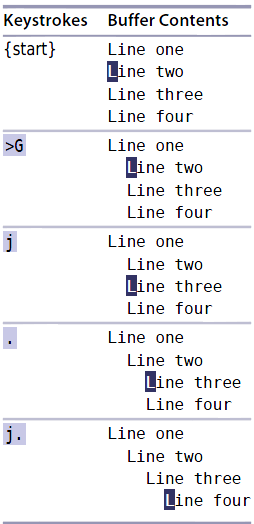

### `>G`:从当前行到最后一行，每行增加一层缩进

1. `>$`:当前行向右缩进一层
2. `><Cr>`: 当前行和其下一行向右缩进一层
> `<Cr>`:回车键
3. `>3<Cr>`: 当前行和其下3行向右缩进一层
4. `>4j`:当前行和其下4行向右缩进一层
5. `>5j`:当前行和其上5行向右缩进一层

   

|上一篇|下一篇|
|:---|---:|
|[README](../README.md)  |[技巧2 不要自我重复](tip2.md)|
