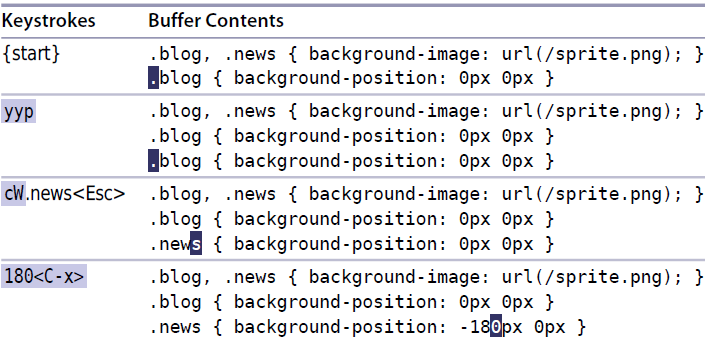

# 技巧10 用次数做简单的算术运算

> 大多数普通模式命令可以在执行时指定执行次数,利用这个进行算术运算

#### `<C-a>` 将光标所在数字的值增加1,`<C-x>`将光标所在单词减1

> 1. **如果光标所在单词不是数字**,则在当前行向后查找数字,如果找到,则将其加一,否则,不操作
> 2. 有的时候对`007`按`<C-x>`可能得到`010`,是系统将其看成了**八进制** 的数,在vimrc文件中设置 `set nrformats=` 这一行可以让vim对所有数字按十进制考虑

`24<C-a>` 将光标所在数字的值加`24`, `28<C-x>`将光标所在数字值减28

### 例子: 修改CSS代码
> 1. 将news替换成blog
> 2. 将0px替换成-180px

  

#### `yyp`: 将当前行复制成两份

等价于 `yy`(先复制当前行) + `p`(再插入到当前行的下方)

#### `cw`: 删除光标所在单词,并进入插入模式

   

|上一篇|下一篇|
|:---|---:|
| [Tip9 尽量构造可重复修改](tip9.md)    | [Tip11 能够重复,就别用次数](tip11.md)|
