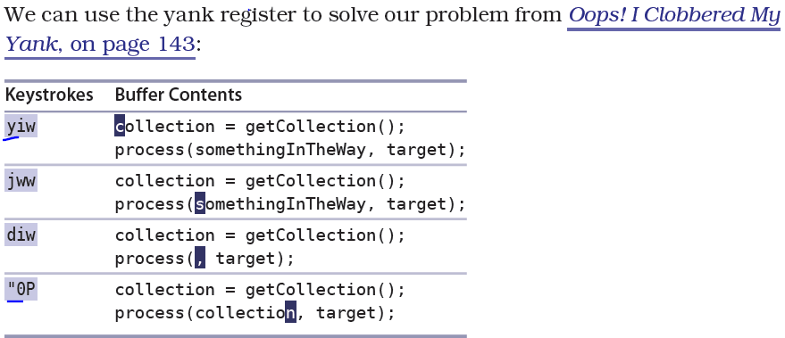
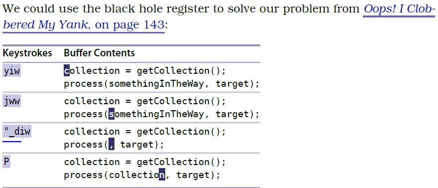

# 技巧60： 深入理解vim寄存器
> 使用shanchu、复制、粘贴操作时，可以指定使用哪一个寄存器

#### `"{register}` 指定使用的寄存器
> [技巧59](tip59.md) 使用`"0`来粘贴复制寄存器中的值

### 例子1：替换单词（技巧59的最后一个例子解法）
> 将`somethingInTheWay`替换成`collection`

#### 解法1：使用`复制专用寄存器("0)`来替换单词
  

1. 只有复制操作会改变复制专用寄存器中的值

#### 解法2：使用有名寄存器（`"a`-`"z`) 来复制和替换单词
  

#### 解法4：使用`黑洞寄存器`来删除单词
  

黑洞寄存器不会存储文本的副本

 

#### 系统粘贴板（`"+`） 和 选择专用寄存器(`"*`)

  

1. `"+p`将外部程序中复制的内容粘贴到光标后面
2. `"+yy`将光标所在行复制到系统粘贴板
3. `"*`表示主剪切板，保存上次被高亮选中的文件,使用`鼠标中键`粘贴出来
> 1. windows 和 Mac OS X没有主剪切板，`"*`和`"+`混用
> 2. `:version`查看`xterm_clipboard`是否激活，`+xterm_clipboard`表明支持主剪切板

#### 表达式寄存器(`"=`)

输入`"=`后vim会进入命令行模式，并显示提示符`=`，敲入一段vim脚本表达式并按`<CR>`执行。如果返回的是字符串或者是可以转换成字符串的数据，则Vim会使用他。

### 例子5：其他寄存器
  

1. `"%`当前文件名
2. `"#`轮换文件名
3. `".`上次插入的文本
4. `":`上次执行的Ex命令
5. `"/`上次查找的模式
> `:let` 可以对`"/` 寄存器进行显示的赋值, 而上面其他的寄存器都是`只读`的

   

|上一篇|下一篇|
|:---|---:|
|[技巧59 用无名寄存器实现删除、复制和粘帖操作](tip59.md)|[技巧61 用寄存器中的内容替换高亮选取的文本](tip61.md)|
