# [图标](.\resource\图标)

1. 运行	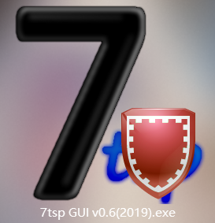
2. 选择    `7tsp Big Sur LightMode.7z`    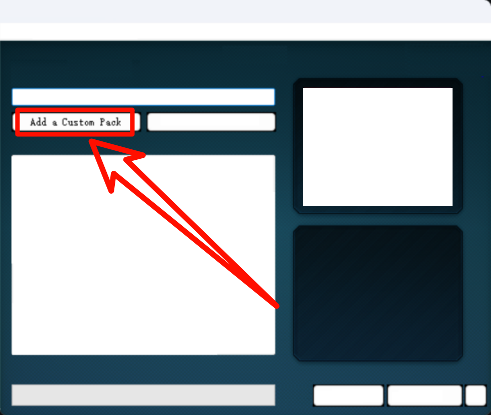
3. 应用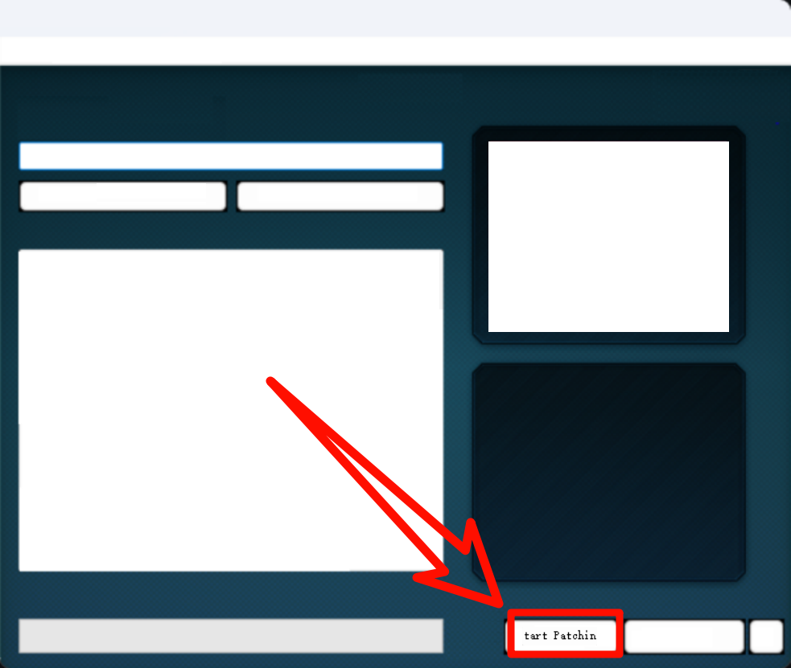

***

# Chrome

## 插件

[规则]( .\resource\插件\uBlock Origin )

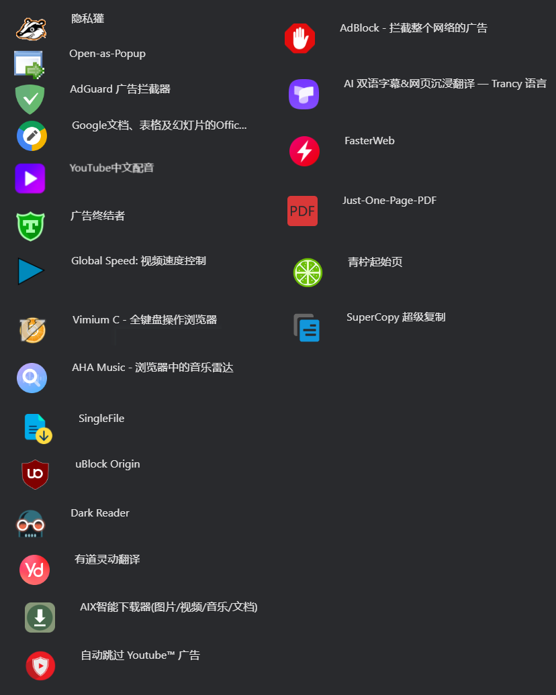

***

## 实验功能

> `chrome://flags`

###### 多线程下载

Parallel downloading

###### 标签缩略图

Tab Hover Card Images

***

# [鼠标指针](.\resource\鼠标指针)

# [文件管理器](.\resource\文件管理器)

# [software](.\resource\Software)

### Tool

[Easy Cat Timer](https://github.com/xujiangjiang/Easy-Cat-Timer)

[OpenArk](https://github.com/BlackINT3/OpenArk)

[Twinkle](https://github.com/xanderfrangos/twinkle-tray)

[WinMemory](https://github.com/IgorMundstein/WinMemoryCleaner)

### [AutoHotkey](https://www.autohotkey.com/)

- [脚本](.\resource\Software\AutoHotkey)
  C:\Users\Administrator\AppData\Roaming\Microsoft\Windows\Start Menu\Programs\Startup

### [Lively Wallpaper](https://github.com/rocksdanister/lively/releases/tag/v2.1.0.8)

- [壁纸](.\resource\Software\Lively Wallpaper\壁纸)

### [localsend](https://localsend.org/zh-CN/download)

### [CopyQ](https://github.com/hluk/CopyQ)

### [geek](https://geekuninstaller.com/)

### [Xmind](https://www.123pan.com/?homeFilePath=5997681,6449044,6449050,10265386)

### [Typora](https://typora.io/)

- [破解](.\resource\Software\Typora\破解)

- [主题](https://github.com/ywyjcloud/Typora-Theme)

- 快捷键修改

  > 偏好设置 \ 通用 \ 打开高级设置 \ conf.user.json
  >
  > 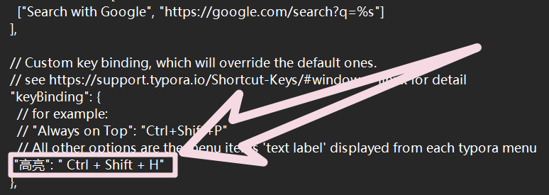

###  [MouseInc](.\resource\Software\MouseInc)

### [PowerToys](https://github.com/microsoft/PowerToys)

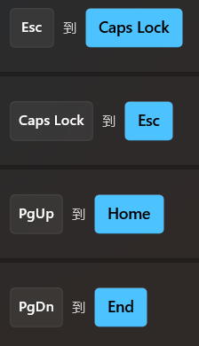

****

# [驱动](https://sdi-tool.org/download/)

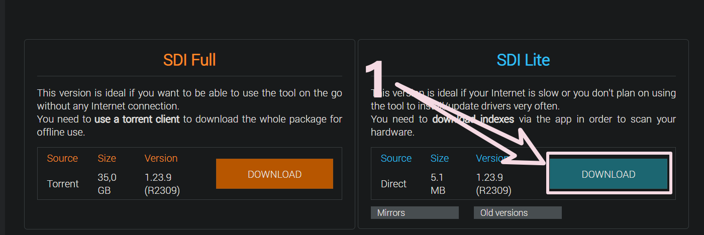

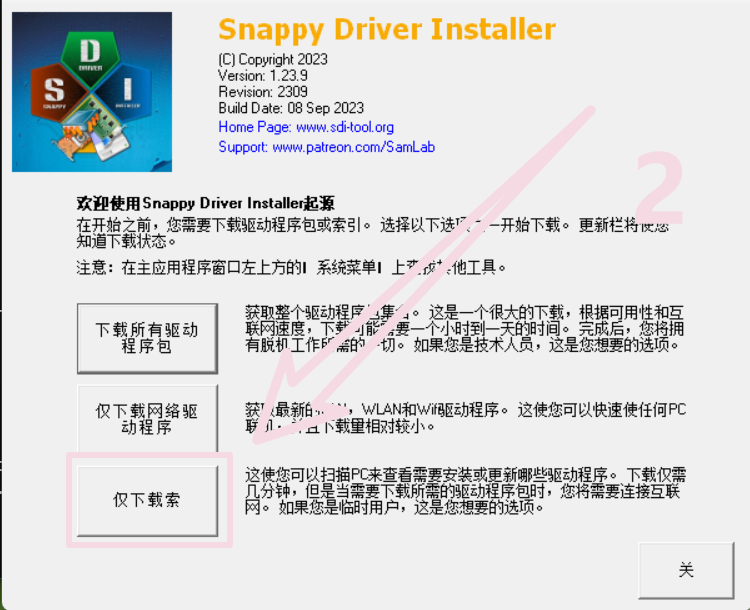

****

# 虚拟内存

1. 

2. 

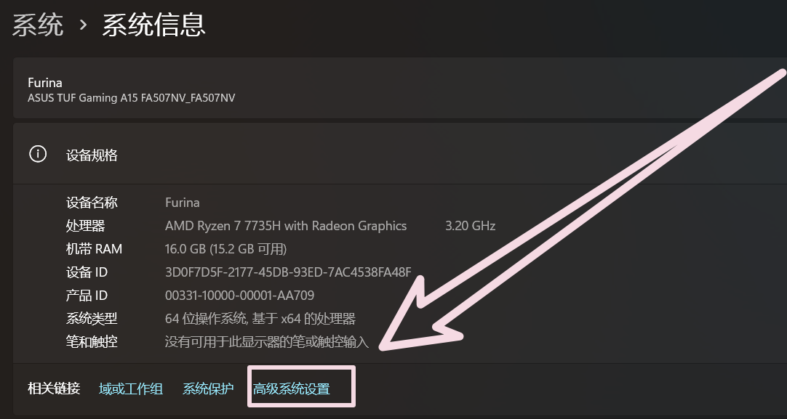

3. 

4. 

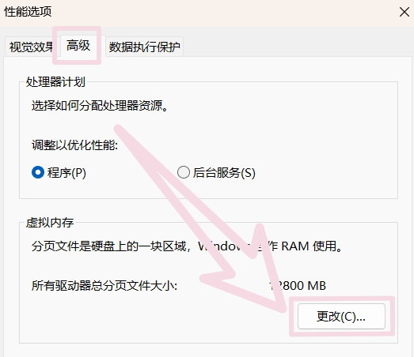

> 设置在==非系统盘==下

5. 

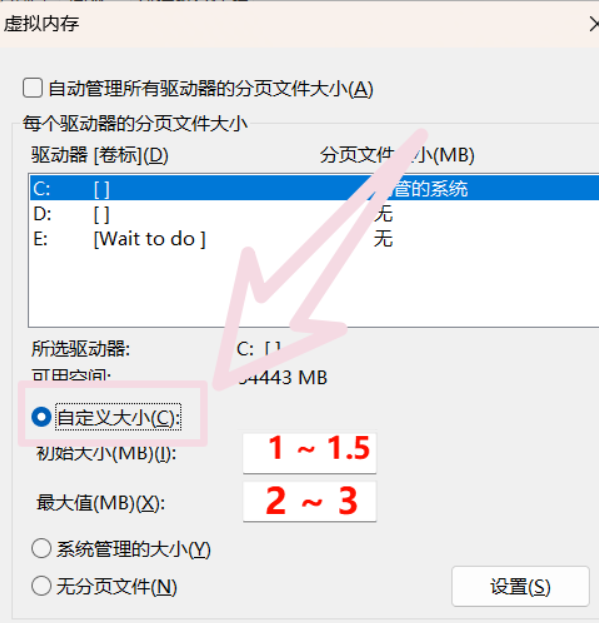

****

# 预装软件卸载

https://github.com/Raphire/Win11Debloat

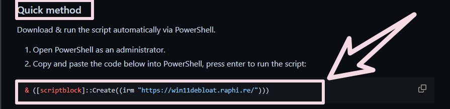

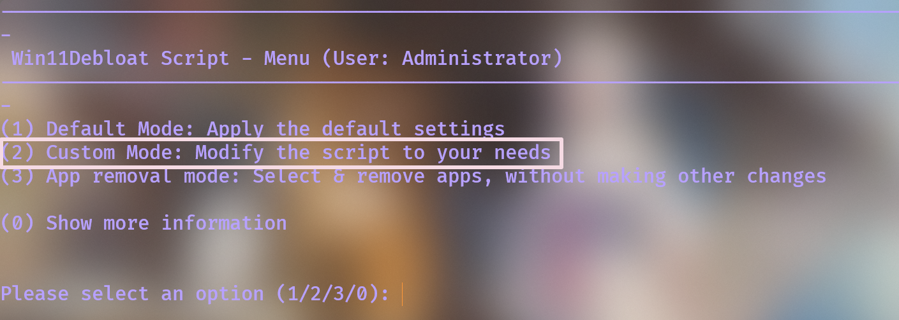

> 2
>
> 选择自定义

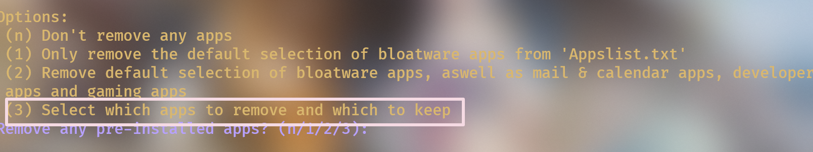

> 3
>
> 自定义选择

参考

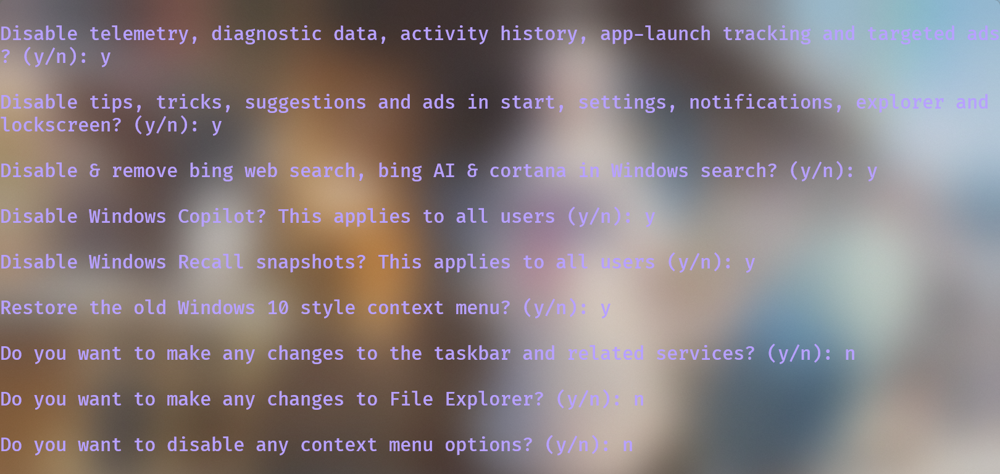
